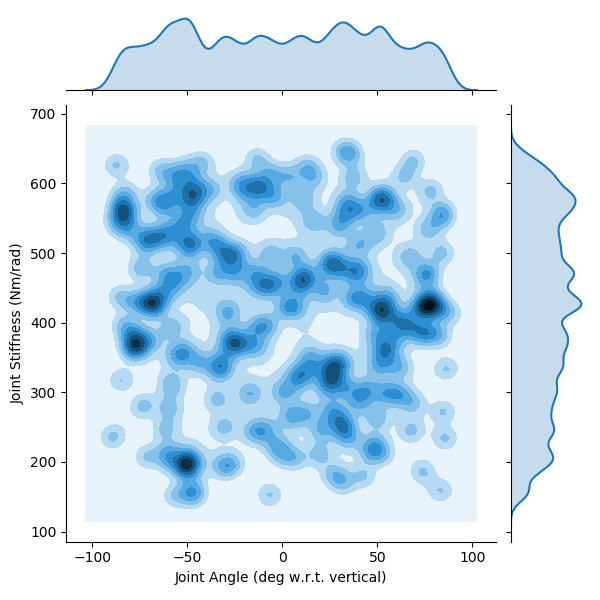
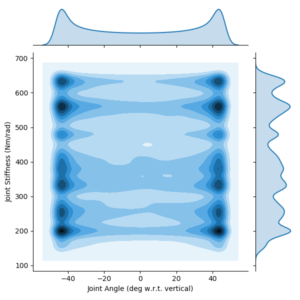
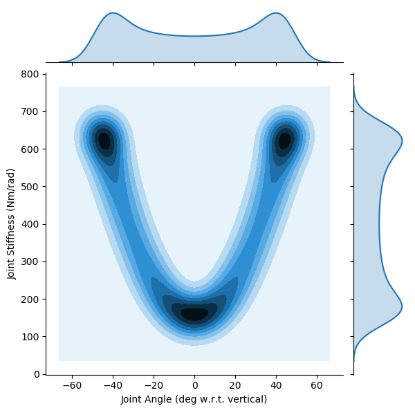

# Trajectories Chosen to Test Generalizability of ANNs That Predict Joint Angles from Non-Collocated Sensory Information

## Notes

High Stiffness Experiment Generalization Trajectories

## Parameters

 ```py
 params = {
    'Tendon Stiffness Coefficients' : {'Spring Stiffness Coefficient': 2, 'Spring Shape Coefficient': 1000},
	'stiffnessRange' : [15, 650],
	'frequency' : 1,
	'delay' : 0.3
}
```

## Figures

#### Angle Step / Stiffness Step

<p align="center">
	
</p>

#### Angle Step / Stiffness Sinusoid

<p align="center">
	
</p>

#### Angle Sinusoid / Stiffness Step

<p align="center">
	
</p>

#### Angle Sinusoid / Stiffness Sinusoid

<p align="center">
	
</p>
