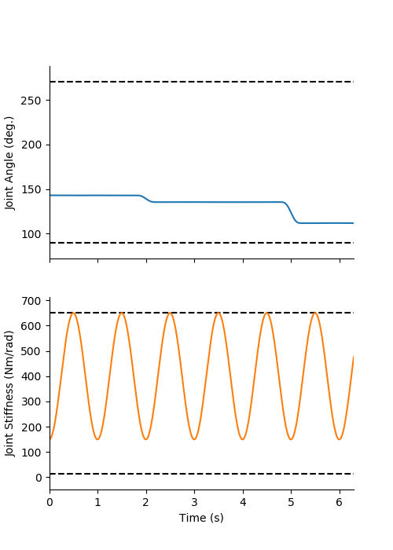
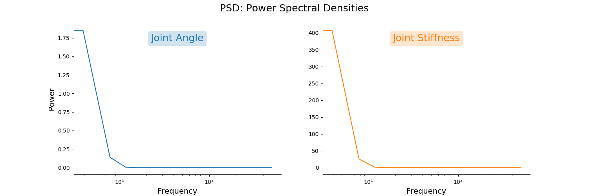
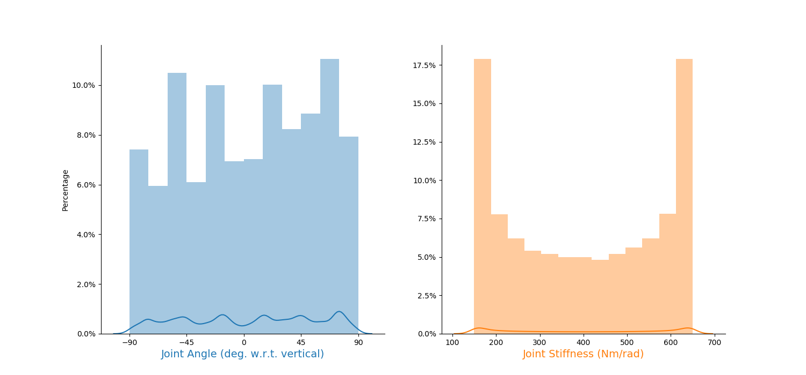
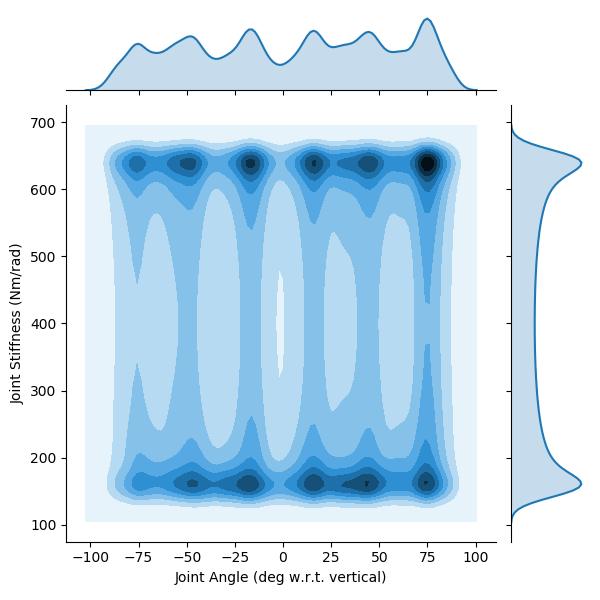
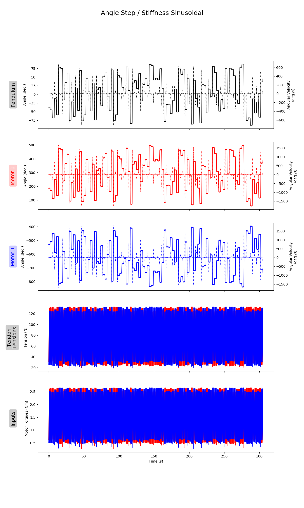
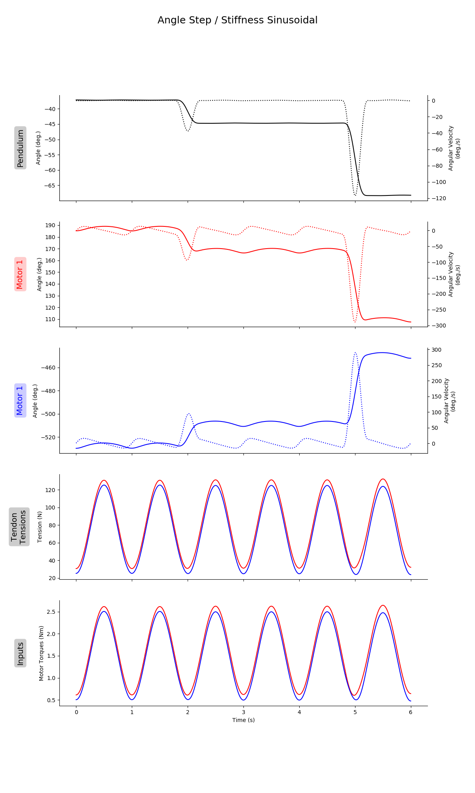
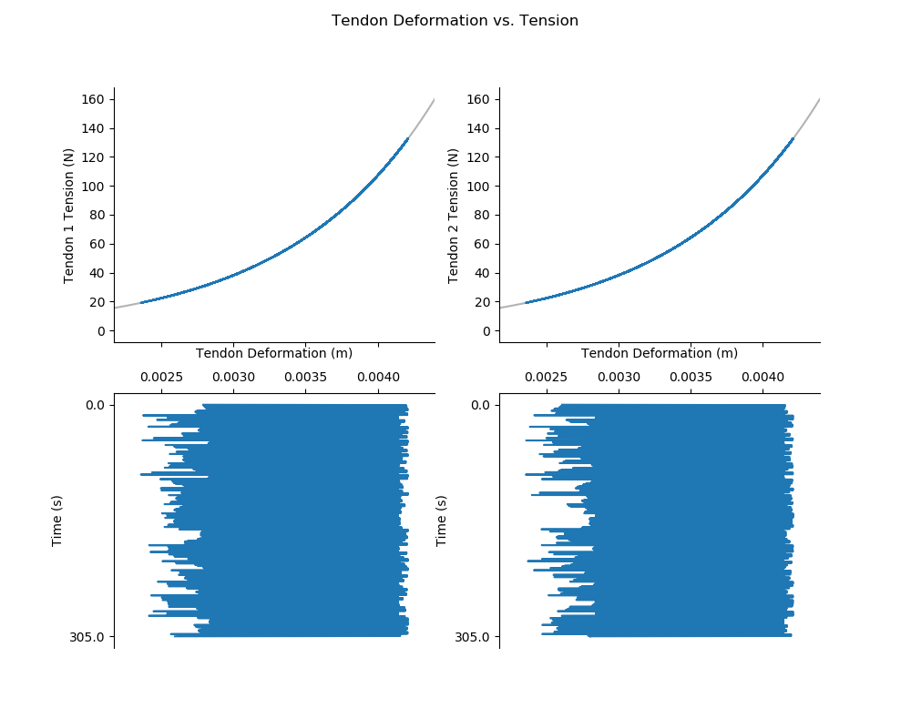

# README.md for Figures Created on 2020/05/18 at 15:09.43 PST.

## Notes

(Point-to-Point Joint Angle / Sinusoidal Joint Stiffness)

## Parameters

```py
params = {
	'Extra Steps' : 5,
	'Step Duration' : 2.0,
	'frequency' : 1,
	'numberOfSteps' : 100,
	'stiffnessRange' : [150, 650],
	'angleRange' : None,
	'delay' : 0.3,
	'Tendon Stiffness Coefficients' : {'Spring Shape Coefficient': 1000, 'Spring Stiffness Coefficient': 2.0}
}
```

## Figures

<p align="center">
	</br>
	<small>Figure 1: Sample joint angle (top) and joint stiffness (bottom) trajectories.</small>
</p>
</br>
</br>

<p align="center">
	</br>
	<small>Figure 2: Power spectral densities for joint angle (left) and joint stiffness (right) trajectories. </small>
</p>
</br>
</br>

<p align="center">
	</br>
	<small>Figure 3: Histograms for joint angle (left) and joint stiffness (right) trajectories.</small>
</p>
</br>
</br>

<p align="center">
	</br>
	<small>Figure 4: Kernel density plots for joint angle (x-axis) and joint stiffness (y-axis) trajectories.</small>
</p>
</br>
</br>

<p align="center">
	</br>
	<small>Figure 5: Entire time history of state/input trajectories.</small>
</p>
</br>
</br>

<p align="center">
	</br>
	<small>Figure 6: Sample of state/input trajectories.</small>
</p>
</br>
</br>

<p align="center">
	</br>
	<small>Figure 7: Tendon tension vs. deformation (stretch) relationships over time.</small>
</p>
</br>
</br>
