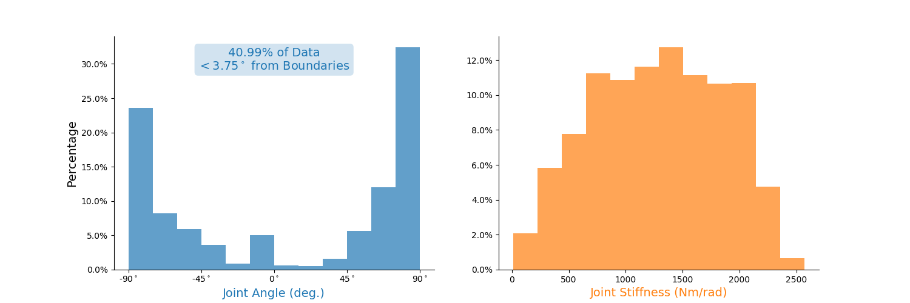
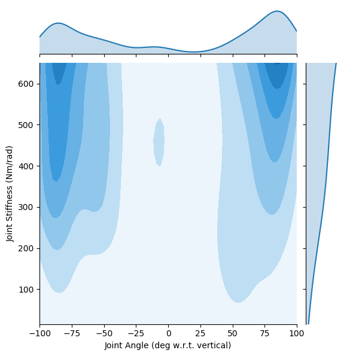

# README.md for Figures Created on 2020/05/18 at 15:55.56 PST.

## Notes

Sample babbling plots for high tendon stiffness experiment.

## Parameters

```py
params = {
	'Joint Inertia' : 0.0115,
	'Joint Damping' : 0.0001,
	'Joint Mass' : 0.541,
	'Joint Moment Arm' : 0.05,
	'Link Center of Mass' : 0.085,
	'Link Length' : 0.3,
	'Motor Inertia' : 6.6e-05,
	'Motor Damping' : 0.00462,
	'Motor Moment Arm' : 0.02,
	'Spring Stiffness Coefficient' : 2.0,
	'Spring Shape Coefficient' : 1000,
	'Simulation Duration' : 15,
	'dt' : 0.001,
	'Position Gains' : {0: 3162.3, 1: 1101.9, 2: 192.0, 3: 19.6},
	'Stiffness Gains' : {0: 316.2, 1: 25.1},
	'Joint Angle Bounds' : {'LB': 1.5707963267948966, 'UB': 4.71238898038469},
	'Maximum Joint Stiffness' : 650,
	'Seed' : None,
	'Filter Length' : 10,
	'Pass Probability' : 0.00025,
	'Input Bounds' : [0, 10],
	'Low Cutoff Frequency' : 1,
	'High Cutoff Frequency' : 10,
	'Buttersworth Filter Order' : 9,
	'Babbling Type' : 'continuous',
	'Force Cocontraction' : True,
	'Cocontraction Standard Deviation' : 0.5,
	'Number of Nodes' : 15,
	'Number of Epochs' : 10000,
	'Number of Trials' : 1
}
```

## Figures

<p align="center">
	</br>
	<small>Figure 1: Plots of states and babbling inputs (bottom).</small>
</p>
</br>
</br>

<p align="center">
	</br>
	<small>Figure 2: Power spectral densities joint angle (left) and joint stiffness (right) movements associated with a motor babbling trial.</small>
</p>
</br>
</br>

<p align="center">
	</br>
	<small>Figure 3: Histograms for joint angle (left) and joint stiffness (right) movements associated with a motor babbling trial.</small>
</p>
</br>
</br>

<p align="center">
	</br>
	<small>Figure 4: Kernel density estimates for joint angle (x-axis) and joint stiffness (y-axis) movements associated with a motor babbling trial.</small>
</p>
</br>
</br>

<p align="center">
	</br>
	<small>Figure 5: Power spectral densities joint angle (left) and joint stiffness (right) movements associated with a motor babbling trial. Stiffness has been limited to &#8804;650.</small>
</p>
</br>
</br>

<p align="center">
	</br>
	<small>Figure 6: Tendon tension-deformation (stretch) relationships for babbling trial.</small>
</p>
</br>
</br>

<p align="center">
	</br>
	<small>Figure 7: Motor babbling input torque signals.</small>
</p>
</br>
</br>

<p align="center">
	</br>
	<small>Figure 8: Power spectral density of the band-limited low frequency white noise motor babbling signals.</small>
</p>
</br>
</br>

<p align="center">
	</br>
	<small>Figure 9: Distributions and kernel density estimates of motor babbling input torques. </small>
</p>
</br>
</br>
