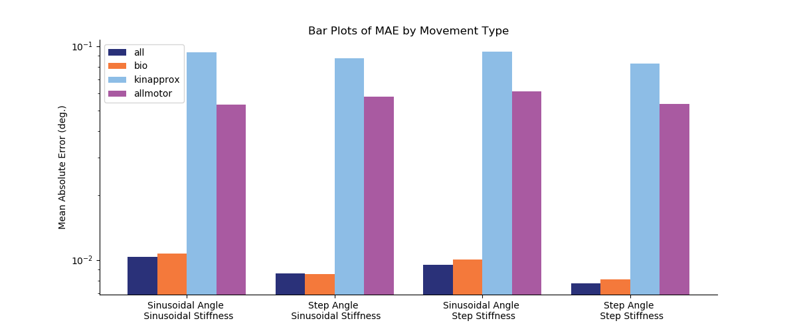

# README.md for Figures Created on 2020/05/18 at 16:15.05 PST.

## Notes

### Sample experiment to test effects of very large stiffness values.


## Parameters

```py
params = {
	'metric' : 'MAE'
}
```

## Figures

<p align="center">
	</br>
	<small>Figure 1: ANN performance across different movement types.</small>
</p>
</br>
</br>
