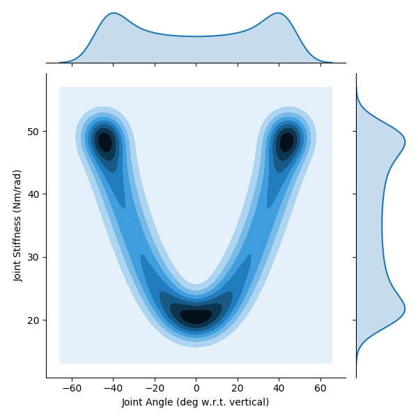

# Trajectories Chosen to Test Generalizability of ANNs That Predict Joint Angles from Non-Collocated Sensory Information

## Notes

Rerunning to show _actual_ trajectory in histograms. Previous versions forced the bins to be between the maximum and minimum joint angles. Stiffness was not forced to be anywhere, so this is good news for the stiffness plots.

## Parameters

 ```py
 params = {
	'stiffnessRange' : [20, 100],
	'frequency' : 1,
	'delay' : 0.3
}
```

## Figures

#### Angle Step / Stiffness Step

<p align="center">
	
</p>

#### Angle Step / Stiffness Sinusoid

<p align="center">
	
</p>

#### Angle Sinusoid / Stiffness Step

<p align="center">
	
</p>

#### Angle Sinusoid / Stiffness Sinusoid

<p align="center">
	
</p>
