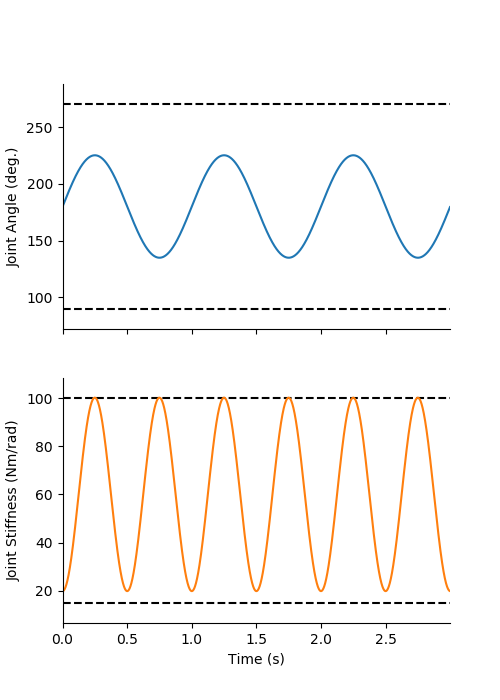
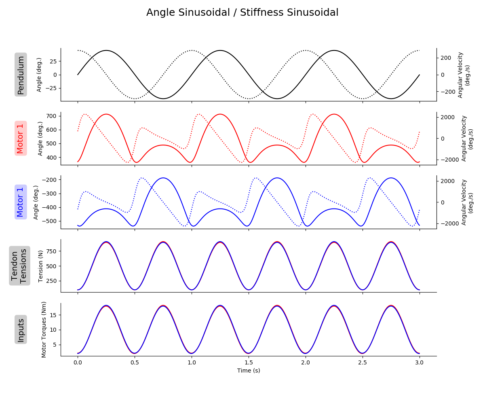
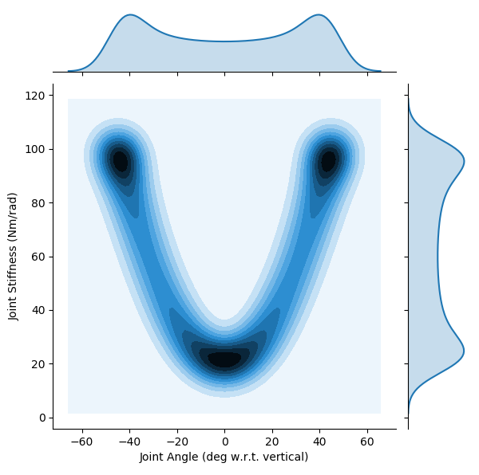
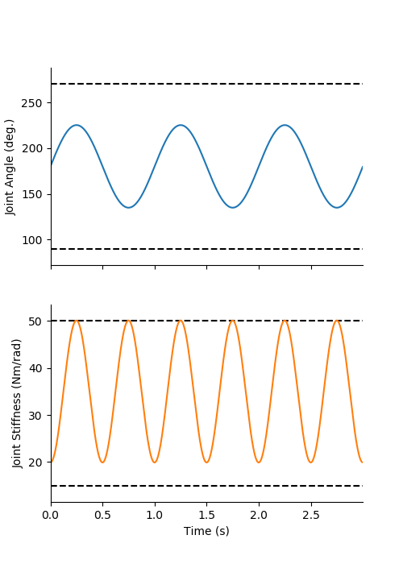
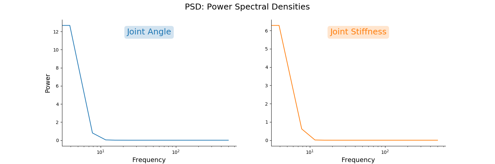
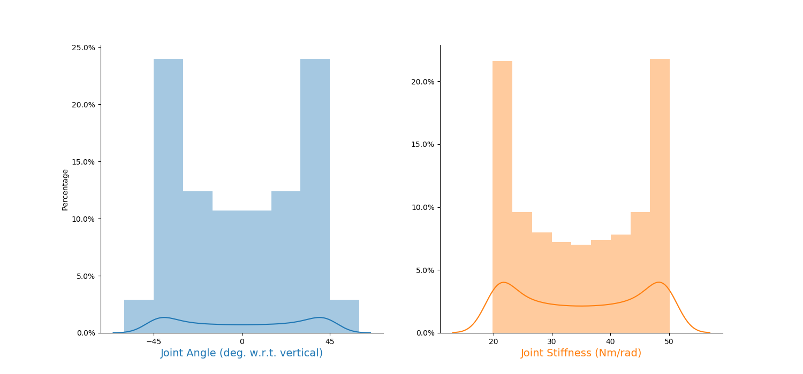
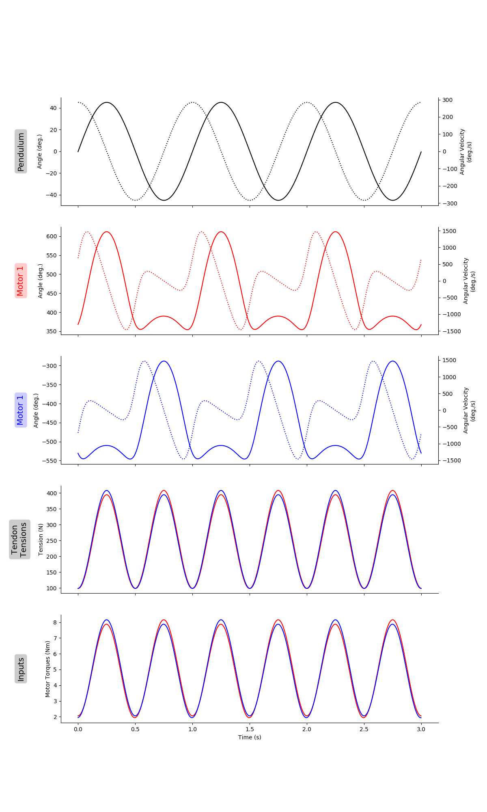
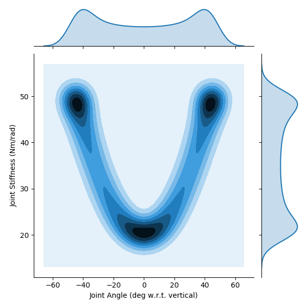

# README.md for Figures Created 2020/04/22 at 17:30.09

## Notes

Rerunning to show _actual_ trajectory in histograms. Previous versions forced the bins to be between the maximum and minimum joint angles. Stiffness was not forced to be anywhere, so this is good news for the stiffness plots.

## Parameters

 ```py
 params = {
	'angleRange' : [2.356194490192345, 3.9269908169872414],
	'frequency' : 1,
	'stiffnessRange' : [20, 100],
	'delay' : 0.3
}
```

## Figures

<p align="center">
	</br>
    <small>Figure 1: Sample output for sinusoidal joint angle and sinusoidal joint stiffness reference trajectories (3 seconds shown).</small>
</p>
</br>
</br>
<p align="center">
	</br>
    <small>Figure 2: Power spectral densities of joint angle (<em>left</em>) and joint stiffness (<em>right</em>). </small>
</p>
</br>
</br>
<p align="center">
	</br>
    <small>Figure 3: Histograms and kernel density estimates of joint angle (<em>left</em>) and joint stiffness (<em>right</em>). </small>
</p>
</br>
</br>
<p align="center">
	</br>
    <small>Figure 4: Sample plot of states (and their derivatives when appropriate, denoted by <em>dotted</em> lines) and inputs (3 seconds shown).  </small>
</p>

It should be noted that the tendon tension and motor torques are *highly* correlated. The Pearson coefficients are ~0.999959 for both motor-tendon complexes. This would imply that it would be equivalent to replace the **difficult to measure** tendon tensions in our predictor algorithms with the readily available motor torques. In biology, we do have efference copies, but these do not directly correlate to tendon tension as they have to contend with nonlinear force-length, force-velocity relationships. Additionally, this is for a system that has not contact with the world. If the pendulum were to experience a sudden impact, the tendon tensions would change instantly, but the motor torques would deviate. But if the controller was predictive or proportional, then it would be likely that the motor torques would eventually become correlated again.
</br>
</br>
<p align="center">
	</br>
    <small>Figure 5: Two dimensional kernel density estimate plots for joint angle (with respect to vertical) and joint stiffness.  </small>
</p>
</br>

# Appended on 2020/05/01 at 17:48.33 PST.

## Notes

Rerunning with smaller stiffness range.

## Parameters

```py
params = {
	'stiffnessRange' : [20, 50],
	'frequency' : 1,
	'angleRange' : [2.356194490192345, 3.9269908169872414],
	'delay' : 0.3
}
```

## Figures

<p align="center">
	</br>
    <small>Figure 6: Sample output for sinusoidal joint angle and sinusoidal joint stiffness reference trajectories with lower stiffness values (3 seconds shown).</small>
</p>
</br>
</br>
<p align="center">
	</br>
    <small>Figure 7: Power spectral densities of joint angle (<em>left</em>) and joint stiffness (<em>right</em>, lower stiffness). </small>
</p>
</br>
</br>
<p align="center">
	</br>
    <small>Figure 8: Histograms and kernel density estimates of joint angle (<em>left</em>) and joint stiffness (<em>right</em>, lower stiffness). </small>
</p>
<p align="center">
	</br>
    <small>Figure 9: Sample plot of states (and their derivatives when appropriate, denoted by <em>dotted</em> lines) and inputs (3 seconds shown).  </small>
</p>
</br>
</br>
<p align="center">
	</br>
    <small>Figure 10: Two dimensional kernel density estimate plots for joint angle (with respect to vertical) and joint stiffness (with lower values).  </small>
</p>
