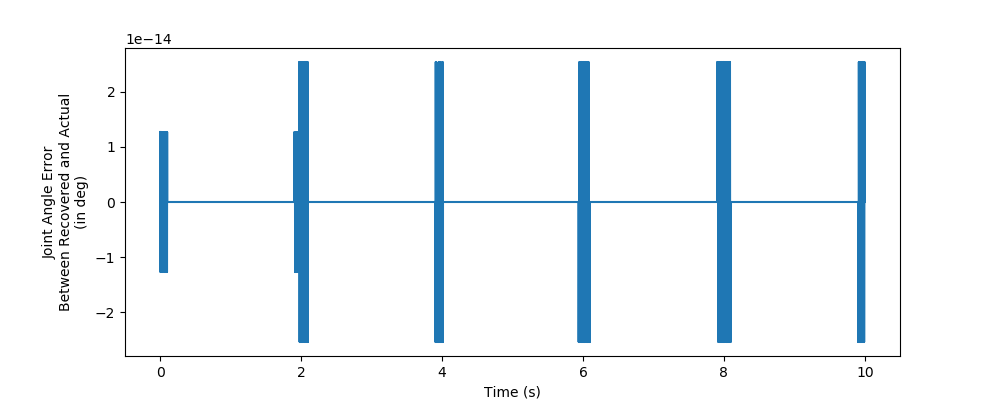
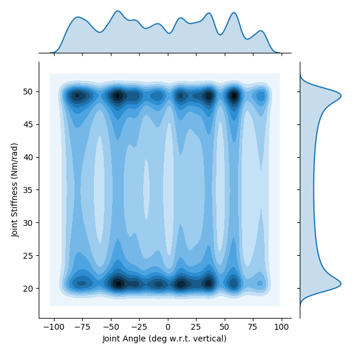

# README.md for Figures Created 2020/04/22 at 17:15.36

## Notes

Rerunning to show _actual_ trajectory in histograms. Previous versions forced the bins to be between the maximum and minimum joint angles. Stiffness was not forced to be anywhere, so this is good news for the stiffness plots.

## Parameters

 ```py
 params = {
	'Extra Steps' : 5,
	'Step Duration' : 2.0,
	'frequency' : 1,
	'numberOfSteps' : 100,
	'stiffnessRange' : [20, 100],
	'angleRange' : None,
	'delay' : 0.3
}
```

## Figures

<p align="center">
	</br>
    <small>Figure 1: Sample output for point-to-point joint angle and sinusoidal joint stiffness reference trajectories (6 seconds shown).</small>
</p>
</br>
</br>
<p align="center">
	</br>
    <small>Figure 2: Power spectral densities of joint angle (<em>left</em>) and joint stiffness (<em>right</em>). </small>
</p>
</br>
</br>
<p align="center">
	</br>
    <small>Figure 3: Histograms and kernel density estimates of joint angle (<em>left</em>) and joint stiffness (<em>right</em>). </small>
</p>
</br>
</br>
<p align="center">
	</br>
    <small>Figure 4: Sample plot of states (and their derivatives when appropriate, denoted by <em>dotted</em> lines) and inputs (6 seconds shown).  </small>
</p>

# Appended on 2020/04/23 at 18:12.54 PST.

## Notes

Observing the histograms of output variables  (as well as the heatmaps of error with respect to joint angle), it became more apparent that larger errors were occuring for neural networks trained without tendon tension when attempting to predict values outside of the range of motion. As we want to get a good indication of how these networks generalize to *actual, realistic trajectories*, it was deemed acceptable to exclude any part of the trajectory where the joint angle is out of bounds.

## Parameters

```py
params = {
	'Joint Angle Bounds' : {'LB': 1.5707963267948966, 'UB': 4.71238898038469}
}
```

## Figures

<p align="center">
	</br>
    <small>Figure 5: Sample output for point-to-point joint angle and sinusoidal joint stiffness reference trajectories (3 seconds shown, <em>in bounds only</em>).</small>
</p>
</br>
</br>
<p align="center">
	</br>
    <small>Figure 6: Power spectral densities of joint angle (<em>left</em>, <em>in bounds only</em>) and joint stiffness (<em>right</em>). </small>
</p>
</br>
</br>
<p align="center">
	</br>
    <small>Figure 7: Histograms and kernel density estimates of joint angle (<em>left</em>, <em>in bounds only</em>) and joint stiffness (<em>right</em>). </small>
</p>
</br>
</br>
<p align="center">
	</br>
    <small>Figure 8: Sample plot of states (and their derivatives when appropriate, denoted by <em>dotted</em> lines) and inputs (6 seconds shown, <em>in bounds only</em>).  </small>
</p>

It should be noted that the tendon tension and motor torques are *highly* correlated. The Pearson coefficients are ~0.99936 for both motor-tendon complexes. This would imply that it would be equivalent to replace the **difficult to measure** tendon tensions in our predictor algorithms with the readily available motor torques. In biology, we do have efference copies, but these do not directly correlate to tendon tension as they have to contend with nonlinear force-length, force-velocity relationships. Additionally, this is for a system that has not contact with the world. If the pendulum were to experience a sudden impact, the tendon tensions would change instantly, but the motor torques would deviate. But if the controller was predictive or proportional, then it would be likely that the motor torques would eventually become correlated again.
</br>
</br>
<p align="center">
	</br>
    <small>Figure 9: Two dimensional kernel density estimate plots for joint angle (with respect to vertical, <em>in bounds only</em>) and joint stiffness.  </small>
</p>
</br>

<!-- # Appended on 2020/04/24 at 17:39.27 PST.

## Notes

Seeing what happens when we try to use optimization techniques to recover the states associated with our movement trajectory. This may require a C4 differentiable trajectory in angle space as well as a C2 differentiable trajectory in joint stiffness space. Could be useful to consider defining the actual trajectories as the sinusoidal function that describes it.

## Parameters

```py
params =
}
```

## Figures

#### quasi_static_recovery_01-01.png

<p align="center">
	
</p>

#### quasi_static_recovery_01-02.png

<p align="center">
	
</p>

### Notes

Note that this produces the correct joint angle trajectory, but because of the fact that joint angle is not C4 differentiable, be are seeing nearly infinite motor angles to handle the step changes. This is why we cant use this type of optimization to recover anything with dynamics unless it is continuously differentiable. -->

# Appended on 2020/05/01 at 17:39.08 PST.

## Notes

Rerunning with smaller stiffness range.

## Parameters

```py
params = {
	'Extra Steps' : 5,
	'Step Duration' : 2.0,
	'frequency' : 1,
	'numberOfSteps' : 100,
	'stiffnessRange' : [20, 50],
	'angleRange' : None,
	'delay' : 0.3
}
```

## Figures

<p align="center">
	</br>
    <small>Figure 10: Sample output for point-to-point joint angle (<em>in bounds only</em>) and sinusoidal joint stiffness reference trajectories (6 seconds shown).</small>
</p>
</br>
</br>
<p align="center">
	</br>
    <small>Figure 11: Power spectral densities of joint angle (<em>left</em>, <em>in bounds only</em>) and joint stiffness (<em>right</em>, with smaller upper bounds). </small>
</p>
</br>
</br>
<p align="center">
	</br>
    <small>Figure 12: Histograms and kernel density estimates of joint angle (<em>left</em>, <em>in bounds only</em>) and joint stiffness (<em>right</em>, with smaller upper bounds). </small>
</p>
</br>
</br>
<p align="center">
	</br>
    <small>Figure 13: Sample plot of states (and their derivatives when appropriate, denoted by <em>dotted</em> lines) and inputs (6 seconds shown).  </small>
</p>
</br>
</br>
<p align="center">
	</br>
    <small>Figure 14: Two dimensional kernel density estimate plots for joint angle (with respect to vertical) and joint stiffness (smaller upper bounds).  </small>
</p>
</br>

# Appended on 2020/05/05 at 18:17.40 PST.

## Notes

It was discovered that large (seemingly single point) step changes existed in the inputs and the positional states. Upon further inspection it was determined that this was caused by asking the feedback linearization algorithm (which utilizes up to the 4<sup>th</sup> derivative of joint angle and the 2<sup>nd</sup> derivative of joint stiffness) to follow a trajectory that was only continuous up to the 1<sup>st</sup> derivative (i.e., it was C<sup>1</sup> differentiable). Therefore, we changed the reference trajectory to be C<sup>4</sup> differentiable to see if it removes these transients. This was done by creating point-to-point trajectories with a modified "minimum jerk" equation to have zero velocity, acceleration, jerk, and snap when arriving and leaving a point. These trajectories were then filtered to recover the more gradual (sub 3 Hz) movements previously simulated. As we can see when comparing Figures 13 & 18, the transients appear to be removed.


## Parameters

```py
params = {
	'Extra Steps' : 5,
	'Step Duration' : 2.0,
	'frequency' : 1,
	'numberOfSteps' : 100,
	'stiffnessRange' : [20, 50],
	'angleRange' : None,
	'delay' : 0.3
}
```

## Figures
<p align="center">
	</br>
    <small>Figure 15: Sample output for point-to-point joint angle and sinusoidal joint stiffness reference trajectories (6 seconds shown) when using C<sup>4</sup> differentiable reference trajectories.</small>
</p>
</br>
</br>
<p align="center">
	</br>
    <small>Figure 16: Power spectral densities of joint angle (<em>left</em>) and joint stiffness (<em>right</em>, with smaller upper bounds) when using C<sup>4</sup> differentiable reference trajectories. </small>
</p>
</br>
</br>
<p align="center">
	</br>
    <small>Figure 17: Histograms and kernel density estimates of joint angle (<em>left</em>) and joint stiffness (<em>right</em>, with smaller upper bounds) when using C<sup>4</sup> differentiable reference trajectories. </small>
</p>
</br>
</br>
<p align="center">
	</br>
    <small>Figure 18: Sample plot of states (and their derivatives when appropriate, denoted by <em>dotted</em> lines) and inputs (6 seconds shown) when using C<sup>4</sup> differentiable reference trajectories.  </small>
</p>
</br>
</br>
<p align="center">
	</br>
    <small>Figure 19: Two dimensional kernel density estimate plots for joint angle (with respect to vertical) and joint stiffness (smaller upper bounds) when using C<sup>4</sup> differentiable reference trajectories.  </small>
</p>
</br>
