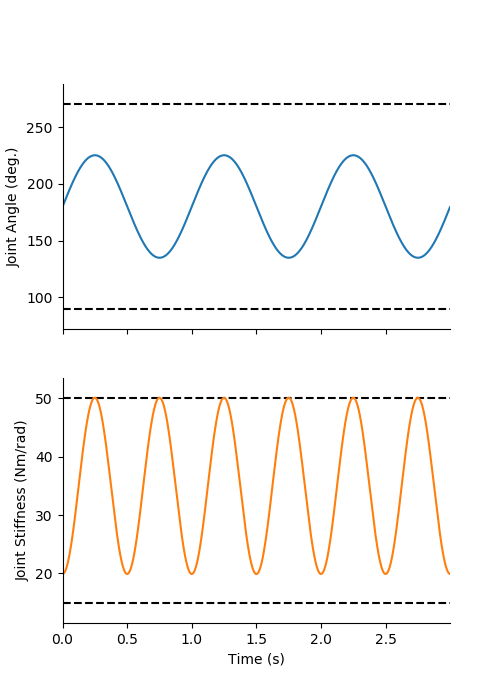
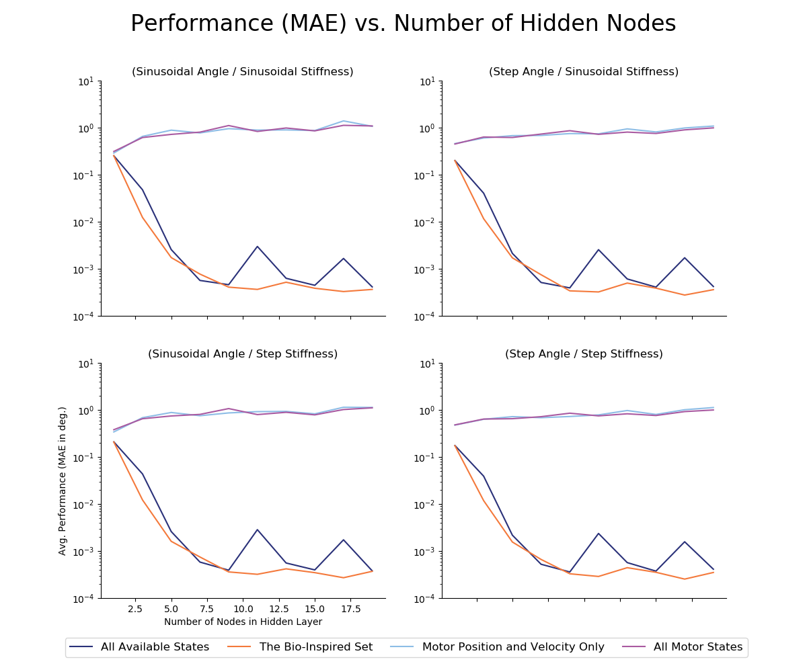

# (MAIN EXPERIMENT)
# Experiments to Test How Well ANNs Perform When the Duration of Motor Babbling or Number of Hidden-Layer Nodes are Varied

## Notes

All Results plots and data were generated from `src/run_multiple_trials_with_different_babbling_durations.py` and `src/run_multiple_trials_with_different_hidden_layer_nodes.py` while the generalization trajectories were generated from `src/generate_new_trajectories.py`. In order to address generalizability as a function of either babbling duration or hidden-layer nodes, we conducted two experiments where (i) babbling duration was varied while hidden-layer nodes was fixed to 15 and (ii) hidden-layer nodes were varied while babbling duration was fixed to 15 seconds.
For each experiment, we tested the performance of ANNs trained on the four sensory sets of interest on the four generalization tasks where joint angles and joint stiffness were either varied sinusoidally or in a point-to-point task.

For the task where both joint angle and joint stiffness are sinusoidal, the same _number of periods_ were used across different frequency trials to ensure that similar configuration space informance was being tested on. Similarly, for the task where joint stiffness was defined by a ramp and hold trajectory, the number of steps was held constant. However, the duration of each step was determined to be equal to 3 periods of the joint angle sinusoid to (i) allow the controller to stabilize along the trajectory (if needed), and (ii) to allow for more reliable data to be collected where the stiffness was relatively constant and the joint angle was varied sinusoidally. With filtering, this produced movements where the joint stiffness is constant for roughly 2 full periods before transitioning to the next value at a 3 Hz cutoff frequency.  

## Parameters

```py
params = {
	'Number of Trials' : 50,
    'Angle Bounds' : [2.356194490192345,3.9269908169872414],
    'Stiffness Bounds' : [20,50],
    'Number of Steps' : 100,
    'Frequencies' : [0.5,1,2,4]
}
```

## Figures

#### Sinusoidal Joint Angle / Sinusoidal Joint Stiffness
<p align="center">
	</br>
	<small>Figure 1: Sinusoidal joint angle (1 Hz) and sinusoidal joint stiffness (2 Hz, phase-locked) task.</small>
</p>
</br>
</br>

#### Sinusoidal Joint Angle / Point-to-Point Joint Stiffness
<p align="center">
	</br>
	<small>Figure 2: Sinusoidal joint angle (1 Hz) and point-to-point joint stiffness (3s step duration, 100 steps) task.</small>
</p>
</br>
</br>

#### Point-to-Point Joint Angle / Sinusoidal Joint Stiffness
<p align="center">
	</br>
	<small>Figure 3: Point-to-point joint angle (3s step duration, 100 steps) and sinusoidal joint stiffness (1 Hz) task.</small>
</p>
</br>
</br>

#### Point-to-Point Joint Angle / Point-to-Point Joint Stiffness
<p align="center">
	</br>
	<small>Figure 4: Point-to-point joint angle and point-to-point joint stiffness task (1s step duration, 200 steps).</small>
</p>
</br>
</br>


## Babbling Duration Sweep Results

<p align="center">
	</br>
	<small>Figure 5: Log-scale average performance (MAE) for 25 ANNs (15 hidden layer nodes) when duration of motor babbling used for training is varied between 1 and 25 seconds (at 1 KHz). ANNs trained with tendon tension drastically outperform those networks trained without it. Performance for all sets only marginally improves after 15 seconds of motor babbling, thus this value was chosen for the subsequent experiments.</small>
</p>
</br>
</br>

## Babbling Duration Sweep Results

<p align="center">
	</br>
	<small>Figure 6: Log-scale average performance (MAE) for 25 ANNs (15 seconds of motor babbling) when number of hidden-layer nodes is varied between 1 and 19. ANNs trained with tendon tension drastically outperform those networks trained without it. Performance for ANNs trained with tendon tension only marginally improve after 15 hidden-layer nodes, thus this value was chosen for the subsequent experiments.</small>
</p>
</br>
</br>
