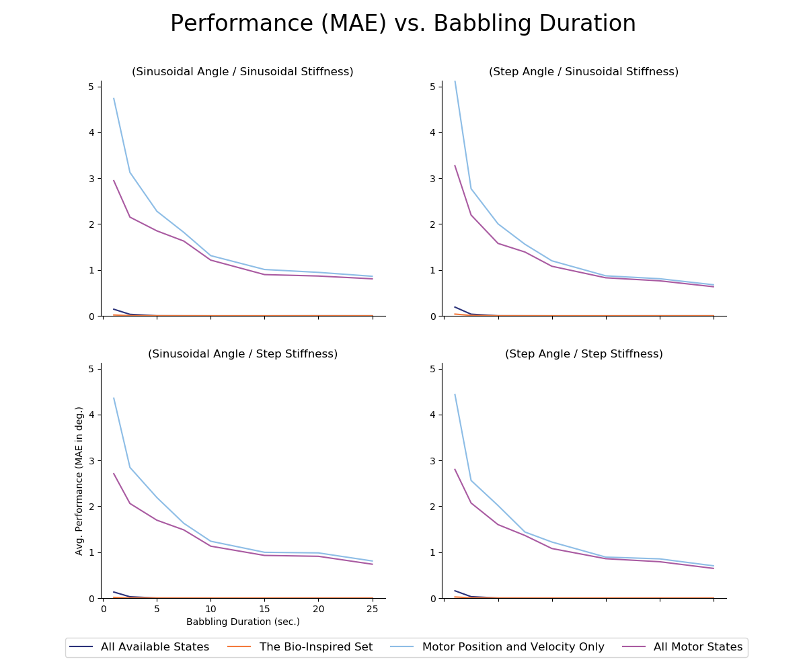
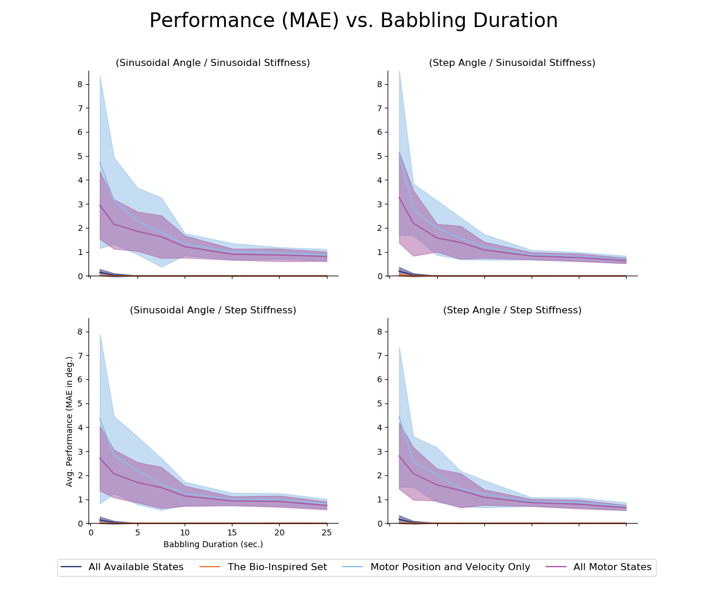
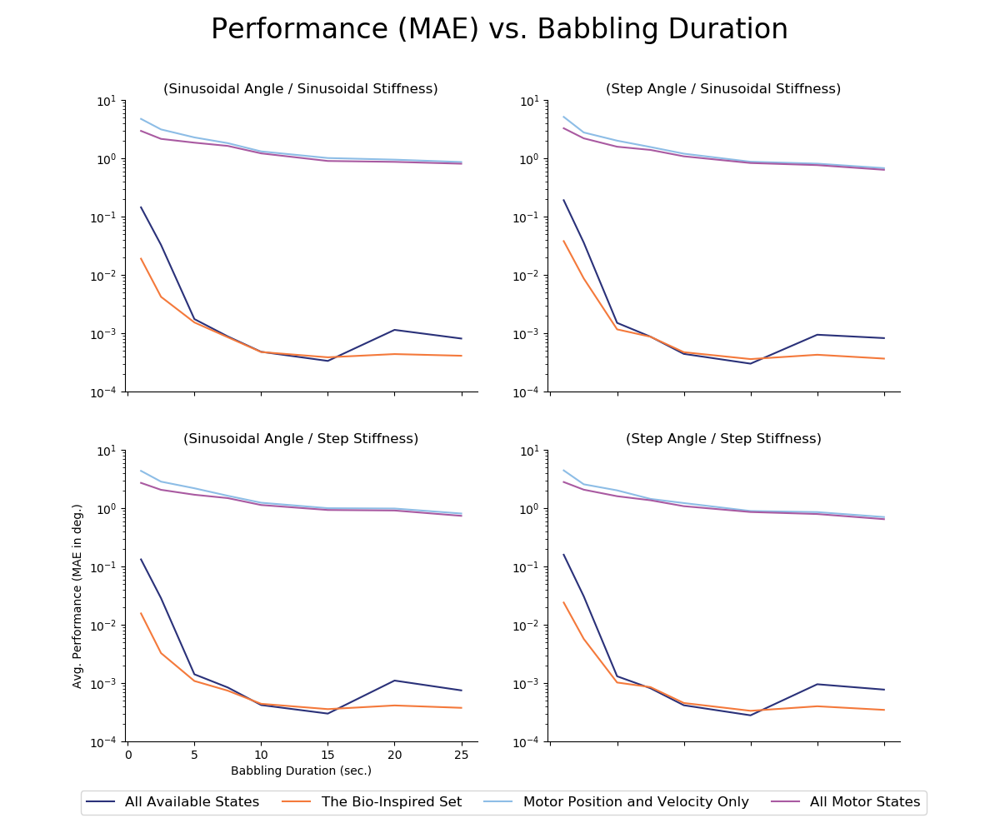
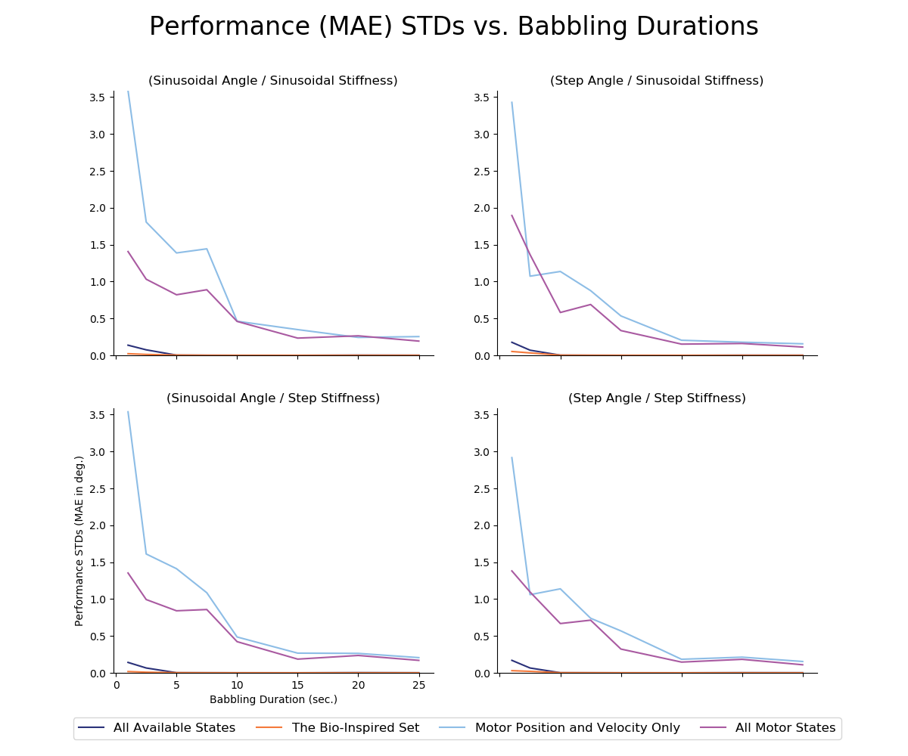
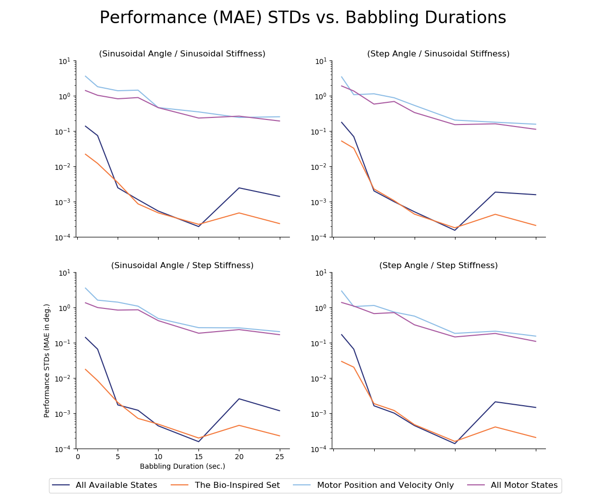

# README.md for Figures Created on 2020/05/12 at 06:57.10 PST.

## Notes

Keeping the number of hidden-layer nodes constant (15) we sweep across the duration of motor babbling (1 KHz) to determine their effect on performance for each of the sensory sets of interest.

## Parameters

```py
params = {
	'Number of Trials' : 25,
	'Babbling Durations' : [1.0,2.5,5.0,7.5, 10.0, 15.0, 20.0, 25.0, 30.0],
	'Number of Nodes' : 15,
	'metrics' : ['MAE'],
	'Babbling Type' : 'continuous',
	'Number of Epochs' : 10000
}
```

## Figures

<p align="center">
	</br>
	<small>Figure 1: Linear-scale average performance (MAE, <em>N</em>=25) versus the duration of motor babbling in each ANN.</small>
</p>
</br>
</br>

<p align="center">
	</br>
	<small>Figure 2: Linear-scale average performance (MAE, <em>N</em>=25) versus the duration of motor babbling in each ANN with standard deviations shaded.</small>
</p>
</br>
</br>

<p align="center">
	</br>
	<small>Figure 3: Log-scale average performance (MAE, <em>N</em>=25) versus the duration of motor babbling in each ANN.</small>
</p>
</br>
</br>

<p align="center">
	</br>
	<small>Figure 4: Linear-scale average performance standard deviation (MAE, <em>N</em>=25) versus the duration of motor babbling in each ANN.</small>
</p>
</br>
</br>

<p align="center">
	</br>
	<small>Figure 5: Log-scale average performance standard deviation (MAE, <em>N</em>=25) versus the duration of motor babbling in each ANN.</small>
</p>
</br>
</br>
