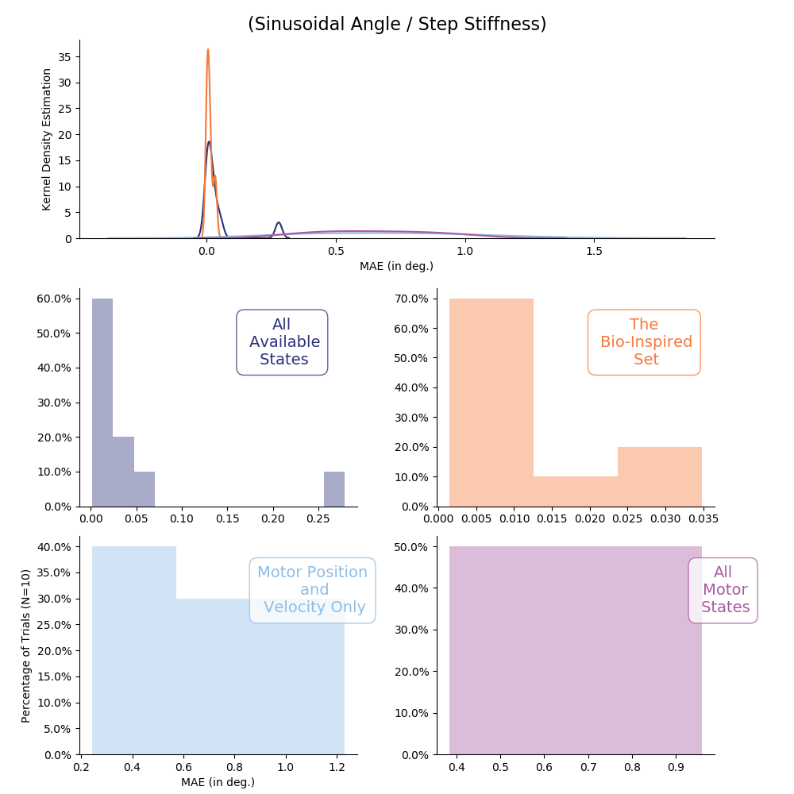

# README.md for Figures Created on 2020/05/12 at 08:55.22 PST.

## Notes

MAE plots for 3 Nodes.

## Parameters

```py
params = {
	'metric' : 'MAE'
}
```

## Figures

<p align="center">
	</br>
	<small>Figure 1: Average ANN performance (MAE, <em>N</em>=10) across sensory sets and movements.</small>
</p>
</br>
</br>

<p align="center">
	</br>
	<small>Figure 2: Distribution of average performance (MAE, <em>N</em>=10) for sinusoidal joint angle and sinusoidal joint stiffness task.</small>
</p>
</br>
</br>

<p align="center">
	</br>
	<small>Figure 3: Distribution of average performance (MAE, <em>N</em>=10) for point-to-point joint angle and sinusoidal joint stiffness task.</small>
</p>
</br>
</br>

<p align="center">
	</br>
	<small>Figure 4: Distribution of average performance (MAE, <em>N</em>=10) for sinusoidal joint angle and point-to-point joint stiffness task.</small>
</p>
</br>
</br>

<p align="center">
	</br>
	<small>Figure 5: Distribution of average performance (MAE, <em>N</em>=10) for point-to-point joint angle and point-to-point joint stiffness task.</small>
</p>
</br>
</br>
