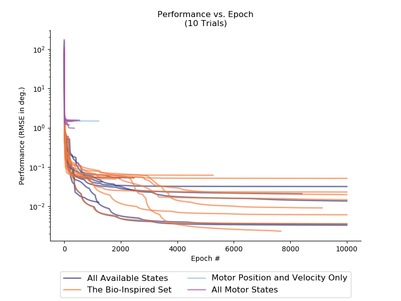
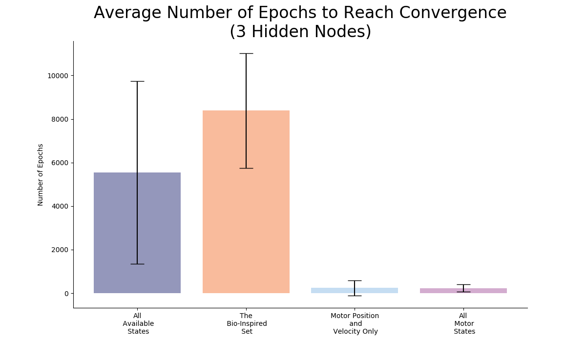
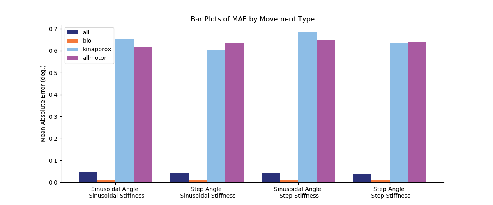
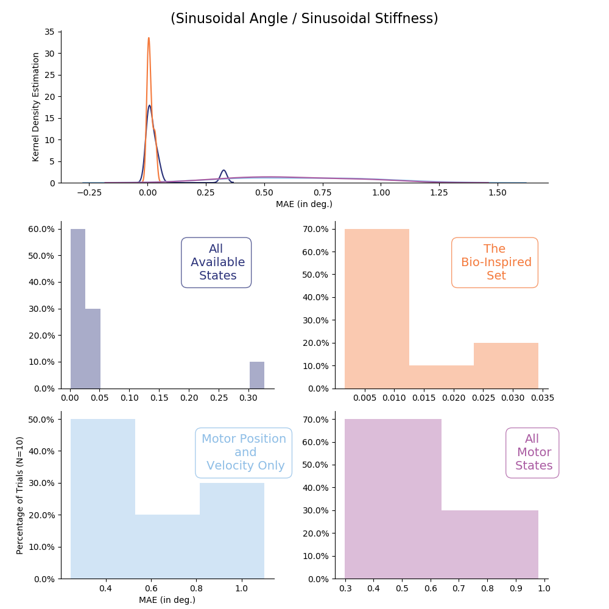
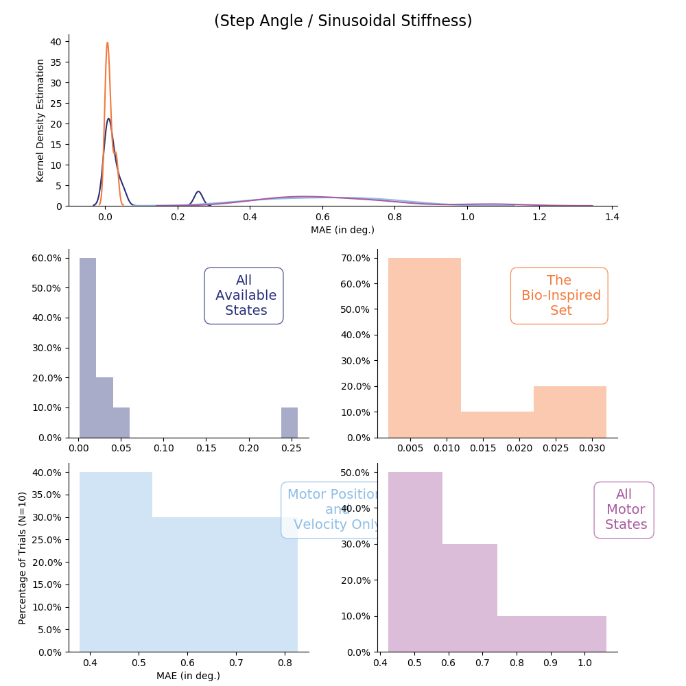
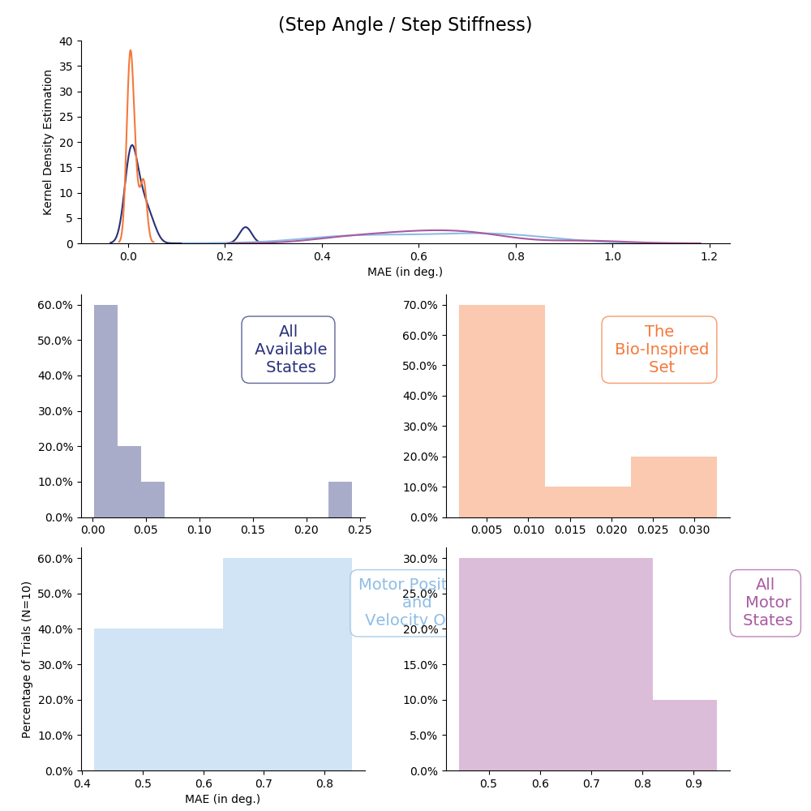

# README.md for Figures Created on 2020/05/12 at 08:55.19 PST.

## Notes

###Plotting Training Performances for Node Number Experiment (3 Nodes)

## Parameters

```py
params = {
	'Babbling Duration' : 15.0,
	'Number of Trials' : 10,
	'Number of Nodes' : 3
}
```

## Figures

<p align="center">
	</br>
	<small>Figure 1: Training performance versus epoch number for all 10 trials for each ANN type.</small>
</p>
</br>
</br>

<p align="center">
	</br>
	<small>Figure 2: Average number of epochs used (<em>N</em>=10).</small>
</p>
</br>
</br>

<p align="center">
	</br>
	<small>Figure 3: Average ANN performance (MAE, <em>N</em>=10) across sensory sets and movements.</small>
</p>
</br>
</br>

<p align="center">
	</br>
	<small>Figure 4: Distribution of average performance (MAE, <em>N</em>=10) for sinusoidal joint angle and sinusoidal joint stiffness task.</small>
</p>
</br>
</br>

<p align="center">
	</br>
	<small>Figure 5: Distribution of average performance (MAE, <em>N</em>=10) for point-to-point joint angle and sinusoidal joint stiffness task.</small>
</p>
</br>
</br>

<p align="center">
	</br>
	<small>Figure 6: Distribution of average performance (MAE, <em>N</em>=10) for sinusoidal joint angle and point-to-point joint stiffness task.</small>
</p>
</br>
</br>

<p align="center">
	</br>
	<small>Figure 7: Distribution of average performance (MAE, <em>N</em>=10) for point-to-point joint angle and point-to-point joint stiffness task.</small>
</p>
</br>
</br>
