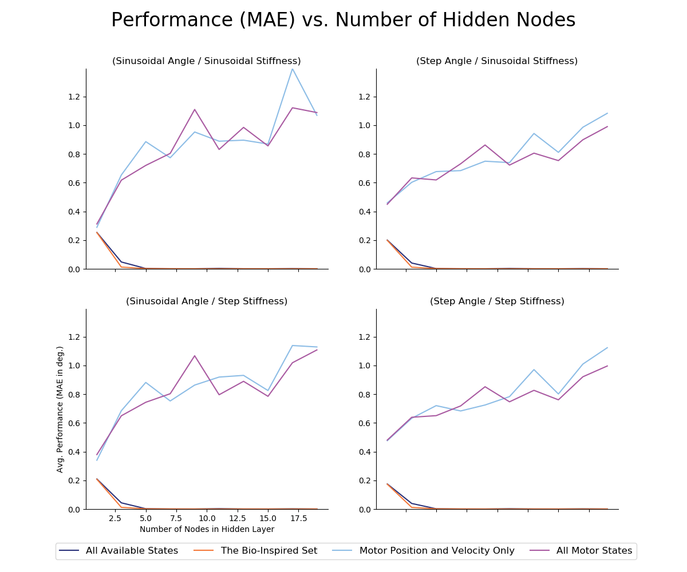
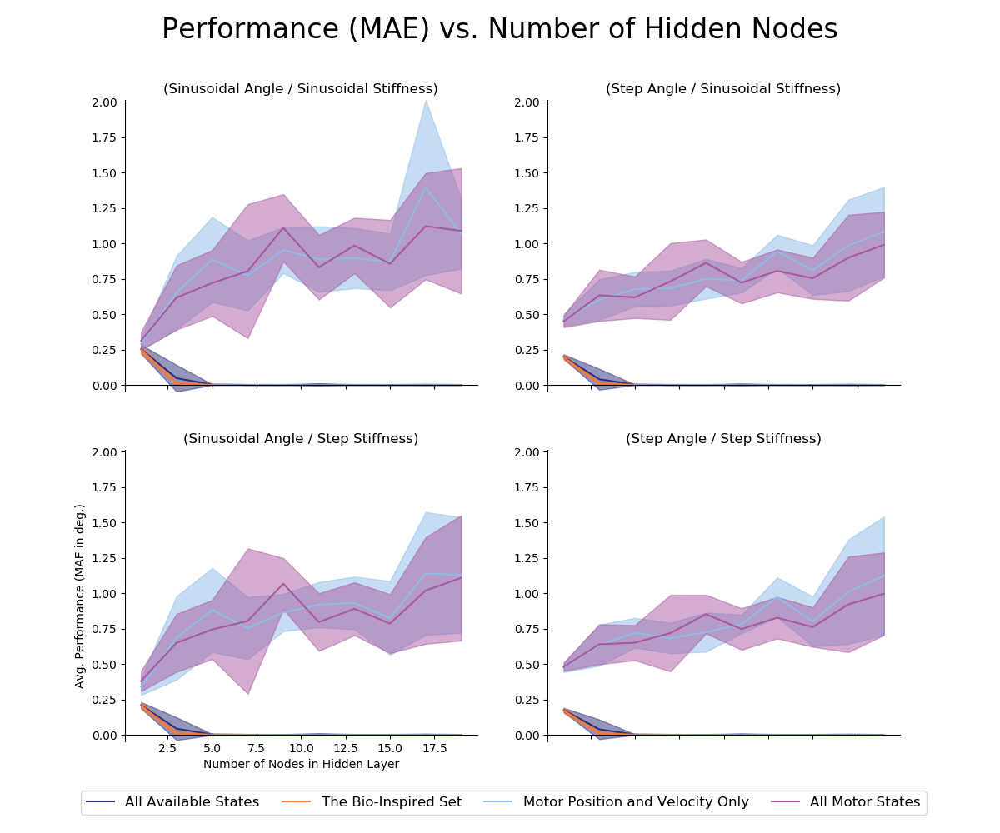
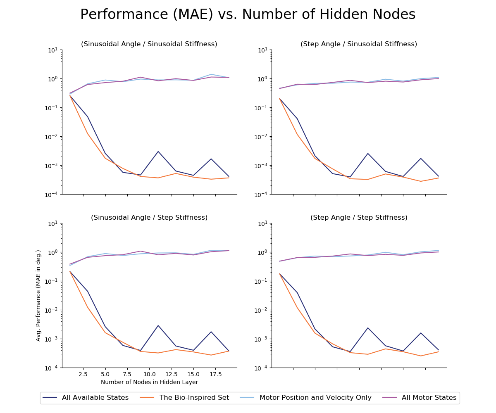
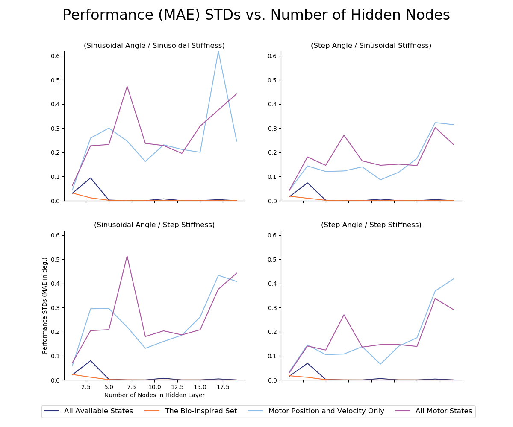
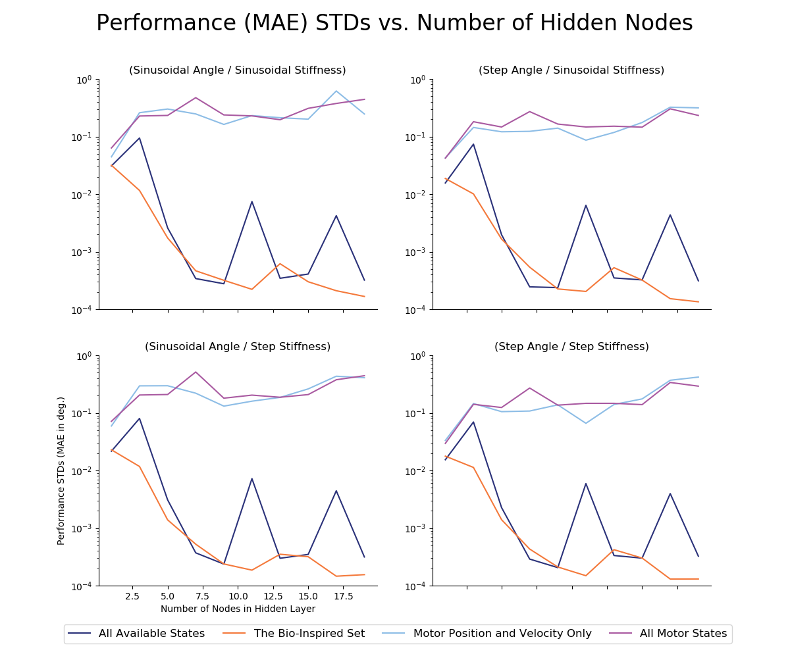

# README.md for Figures Created on 2020/05/12 at 15:51.09 PST.

## Notes

Keeping the duration of motor babbling constant (15 seconds, 1 KHz) we sweep across the number of hidden-layer nodes to determine their effect on performance for each of the sensory sets of interest.

## Parameters

```py
params = {
	'Number of Trials' : 10,
	'Babbling Durations' : 15.0,
	'Number of Nodes List' : [3, 5, 7, 9, 11, 13, 15, 17, 19],
	'metrics' : ['MAE'],
	'Babbling Type' : 'continuous'
}
```

## Figures

<p align="center">
	</br>
	<small>Figure 1: Linear-scale average performance (MAE, <em>N</em>=10) versus the number of hidden-layer nodes in each ANN.</small>
</p>
</br>
</br>

<p align="center">
	</br>
	<small>Figure 2: Linear-scale average performance (MAE, <em>N</em>=10) versus the number of hidden-layer nodes in each ANN with standard deviations shaded.</small>
</p>
</br>
</br>

<p align="center">
	</br>
	<small>Figure 3: Log-scale average performance (MAE, <em>N</em>=10) versus the number of hidden-layer nodes in each ANN.</small>
</p>
</br>
</br>

<p align="center">
	</br>
	<small>Figure 4: Linear-scale average performance standard deviation (MAE, <em>N</em>=10) versus the number of hidden-layer nodes in each ANN.</small>
</p>
</br>
</br>

<p align="center">
	</br>
	<small>Figure 5: Log-scale average performance standard deviation (MAE, <em>N</em>=10) versus the number of hidden-layer nodes in each ANN.</small>
</p>
</br>
</br>
