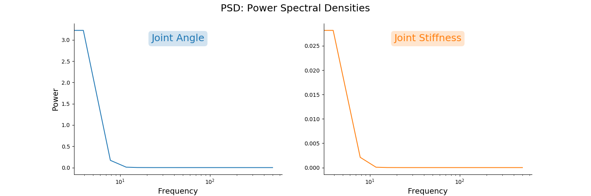
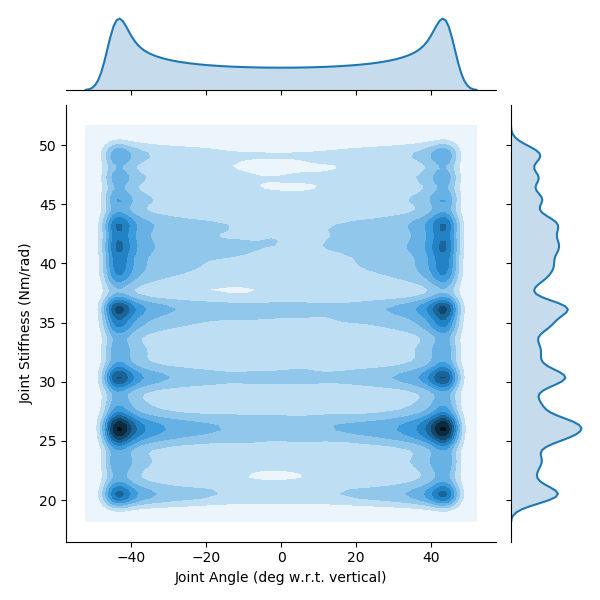
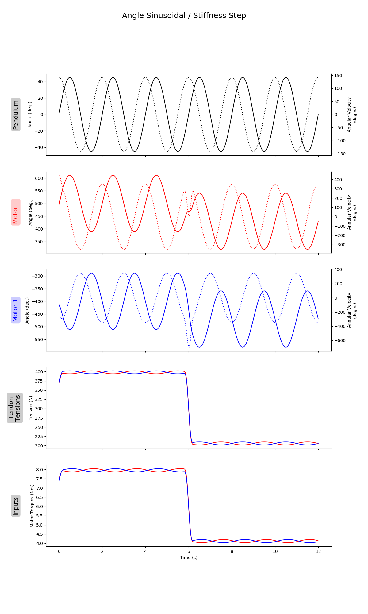
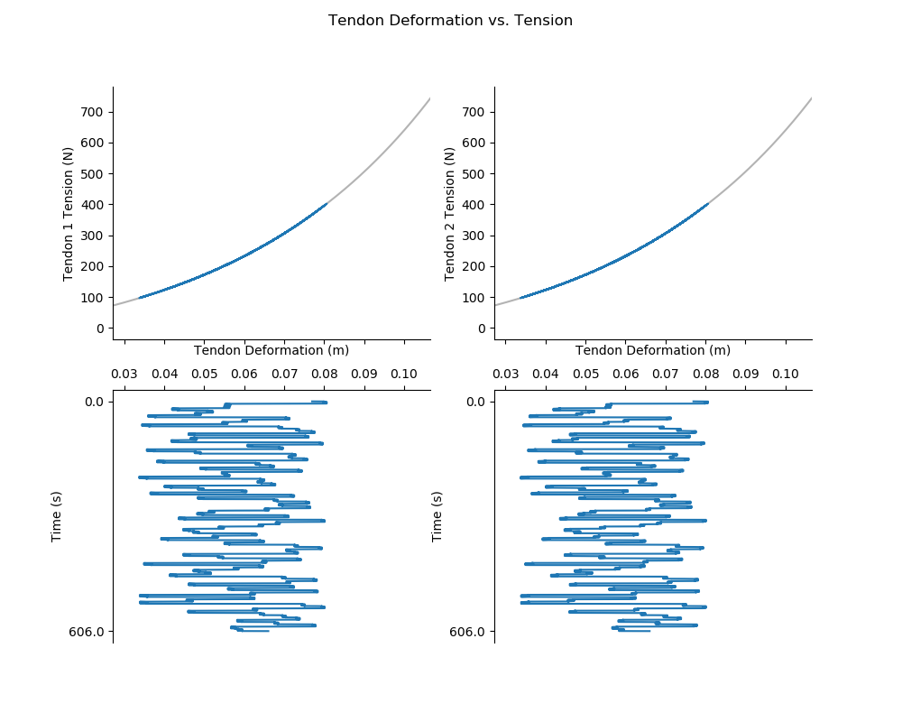

# README.md for Figures Created on 2020/05/13 at 13:23.17 PST.

## Notes

### 0.5 Hz Movement
(Sinusoidal Joint Angle / Point-to-Point Joint Stiffness)

## Parameters

```py
params = {
	'Extra Steps' : 3,
	'Step Duration' : 4.0,
	'angleRange' : [2.356194490192345, 3.9269908169872414],
	'frequency' : 0.5,
	'stiffnessRange' : [20, 50],
	'numberOfSteps' : 100,
	'delay' : 0.3,
	'Tendon Stiffness Coefficients' : {'Spring Stiffness Coefficient': 100, 'Spring Shape Coefficient': 20},
	'Motor Damping' : 0.00462
}
```

## Figures

<p align="center">
	</br>
	<small>Figure 1: Sample joint angle (top) and joint stiffness (bottom) trajectories.</small>
</p>
</br>
</br>

<p align="center">
	</br>
	<small>Figure 2: Power spectral densities for joint angle (left) and joint stiffness (right) trajectories. </small>
</p>
</br>
</br>

<p align="center">
	</br>
	<small>Figure 3: Histograms for joint angle (left) and joint stiffness (right) trajectories.</small>
</p>
</br>
</br>

<p align="center">
	</br>
	<small>Figure 4: Kernel density plots for joint angle (x-axis) and joint stiffness (y-axis) trajectories.</small>
</p>
</br>
</br>

<p align="center">
	</br>
	<small>Figure 5: Entire time history of state/input trajectories.</small>
</p>
</br>
</br>

<p align="center">
	</br>
	<small>Figure 6: Sample of state/input trajectories.</small>
</p>
</br>
</br>

<p align="center">
	</br>
	<small>Figure 7: Tendon tension vs. deformation (stretch) relationships over time.</small>
</p>
</br>
</br>
