# README.md for Figures Created 2020/04/22 at 17:30.09

## Notes

### 1.0 Hz Movement
(Sinusoidal Joint Angle / Point-to-Point Joint Stiffness)

Rerunning to show _actual_ trajectory in histograms. Previous versions forced the bins to be between the maximum and minimum joint angles. Stiffness was not forced to be anywhere, so this is good news for the stiffness plots.

## Parameters

 ```py
 params = {
	'Extra Steps' : 3,
	'Step Duration' : 2.0,
	'angleRange' : [2.356194490192345, 3.9269908169872414],
	'frequency' : 1,
	'stiffnessRange' : [20, 100],
	'numberOfSteps' : 100,
	'delay' : 0.3
}
```

## Figures

<p align="center">
	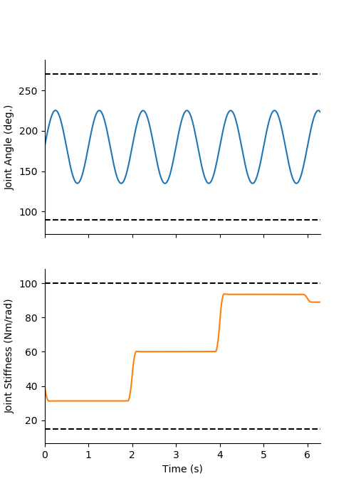</br>
    <small>Figure 1: Sample output for sinusoidal joint angle and point-to-point joint stiffness reference trajectories (6 seconds shown).</small>
</p>
</br>
</br>
<p align="center">
	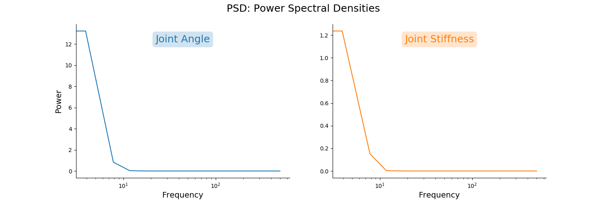</br>
    <small>Figure 2: Power spectral densities of joint angle (<em>left</em>) and joint stiffness (<em>right</em>). </small>
</p>
</br>
</br>
<p align="center">
	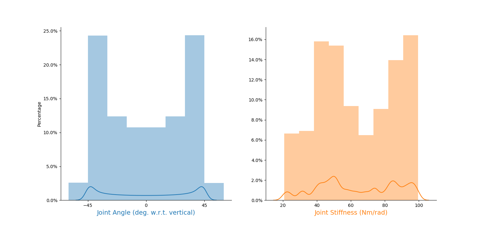</br>
    <small>Figure 3: Histograms and kernel density estimates of joint angle (<em>left</em>) and joint stiffness (<em>right</em>). </small>
</p>
</br>
</br>
<p align="center">
	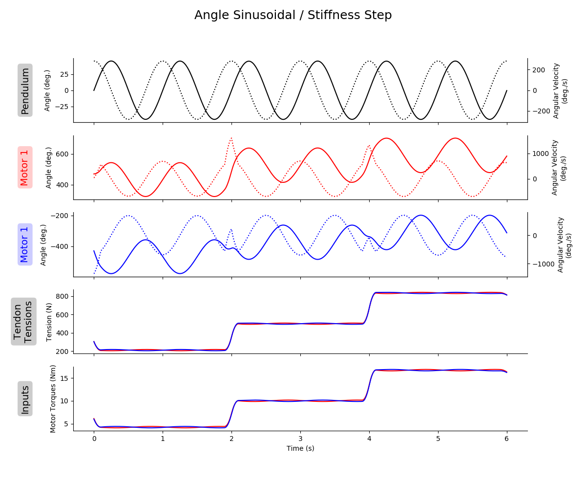</br>
    <small>Figure 4: Sample plot of states (and their derivatives when appropriate, denoted by <em>dotted</em> lines) and inputs (6 seconds shown).  </small>
</p>

It should be noted that the tendon tension and motor torques are *highly* correlated. The Pearson coefficients are ~0.999959 for both motor-tendon complexes. This would imply that it would be equivalent to replace the **difficult to measure** tendon tensions in our predictor algorithms with the readily available motor torques. In biology, we do have efference copies, but these do not directly correlate to tendon tension as they have to contend with nonlinear force-length, force-velocity relationships. Additionally, this is for a system that has not contact with the world. If the pendulum were to experience a sudden impact, the tendon tensions would change instantly, but the motor torques would deviate. But if the controller was predictive or proportional, then it would be likely that the motor torques would eventually become correlated again.
</br>
</br>
<p align="center">
	</br>
    <small>Figure 5: Two dimensional kernel density estimate plots for joint angle (with respect to vertical) and joint stiffness.  </small>
</p>
</br>

# Appended on 2020/05/05 at 08:10.15 PST.

## Notes

Rerunning with smaller stiffness range.

## Parameters

```py
params = {
	'Extra Steps' : 3,
	'Step Duration' : 2.0,
	'angleRange' : [2.356194490192345, 3.9269908169872414],
	'frequency' : 1,
	'stiffnessRange' : [20, 50],
	'numberOfSteps' : 100,
	'delay' : 0.3
}
```

## Figures

<p align="center">
	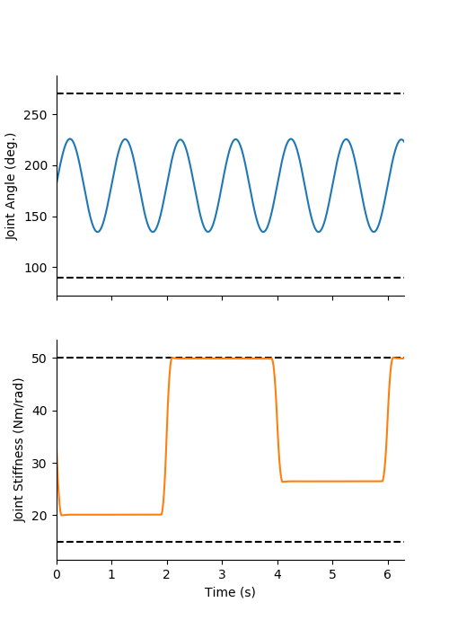</br>
    <small>Figure 6: Sample output for sinusoidal joint angle and point-to-point joint stiffness reference trajectories (6 seconds shown).</small>
</p>
</br>
</br>
<p align="center">
	</br>
    <small>Figure 7: Power spectral densities of joint angle (<em>left</em>) and joint stiffness (<em>right</em>, with smaller upper bounds). </small>
</p>
</br>
</br>
<p align="center">
	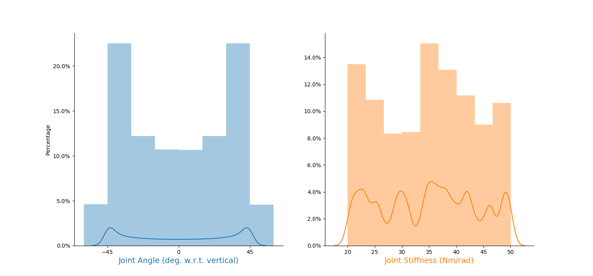</br>
    <small>Figure 8: Histograms and kernel density estimates of joint angle (<em>left</em>) and joint stiffness (<em>right</em>, with smaller upper bounds). </small>
</p>
</br>
</br>
<p align="center">
	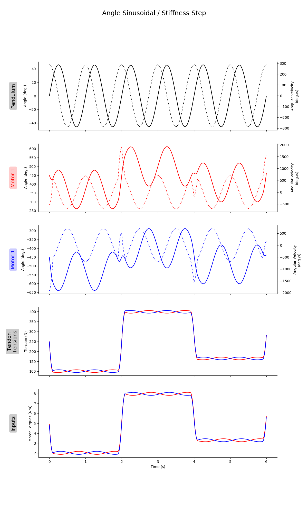</br>
    <small>Figure 9: Sample plot of states (and their derivatives when appropriate, denoted by <em>dotted</em> lines) and inputs (6 seconds shown).  </small>
</p>
</br>
</br>
<p align="center">
	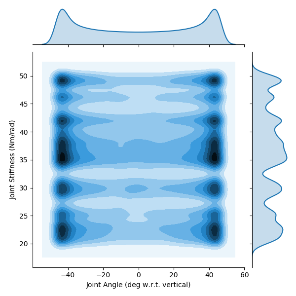</br>
    <small>Figure 10: Two dimensional kernel density estimate plots for joint angle (with respect to vertical) and joint stiffness (smaller upper bounds).  </small>
</p>
</br>

# Appended on 2020/05/05 at 18:25.18 PST.

## Notes

It was discovered that large (seemingly single point) step changes existed in the inputs and the positional states. Upon further inspection it was determined that this was caused by asking the feedback linearization algorithm (which utilizes up to the 4<sup>th</sup> derivative of joint angle and the 2<sup>nd</sup> derivative of joint stiffness) to follow a trajectory that was only continuous up to the 1<sup>st</sup> derivative (i.e., it was C<sup>1</sup> differentiable). Therefore, we changed the reference trajectory to be C<sup>4</sup> differentiable to see if it removes these transients. This was done by creating point-to-point trajectories with a modified "minimum jerk" equation to have zero velocity, acceleration, jerk, and snap when arriving and leaving a point. These trajectories were then filtered to recover the more gradual (sub 3 Hz) movements previously simulated. As we can see when comparing Figures 9 & 14, the transients appear to be removed.

## Parameters

```py
params = {
	'Extra Steps' : 3,
	'Step Duration' : 2.0,
	'angleRange' : [2.356194490192345, 3.9269908169872414],
	'frequency' : 1,
	'stiffnessRange' : [20, 50],
	'numberOfSteps' : 100,
	'delay' : 0.3
}
```

## Figures
<p align="center">
	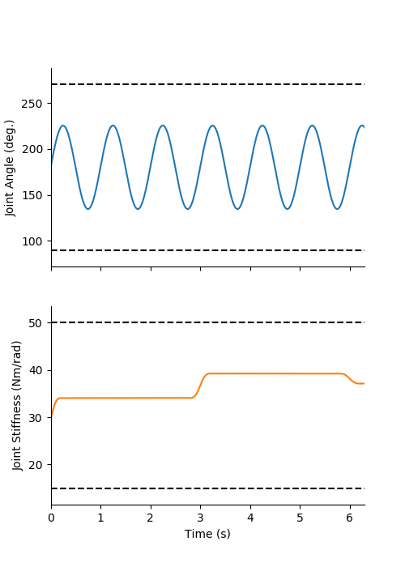</br>
    <small>Figure 11: Sample output for sinusoidal joint angle and point-to-point joint stiffness reference trajectories (6 seconds shown) when using C<sup>4</sup> differentiable reference trajectories.</small>
</p>
</br>
</br>
<p align="center">
	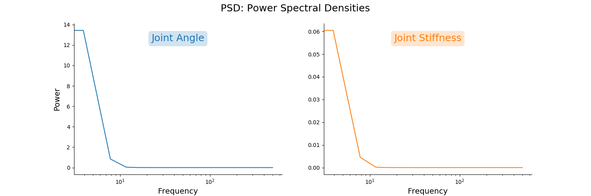</br>
    <small>Figure 12: Power spectral densities of joint angle (<em>left</em>) and joint stiffness (<em>right</em>, with smaller upper bounds) when using C<sup>4</sup> differentiable reference trajectories. </small>
</p>
</br>
</br>
<p align="center">
	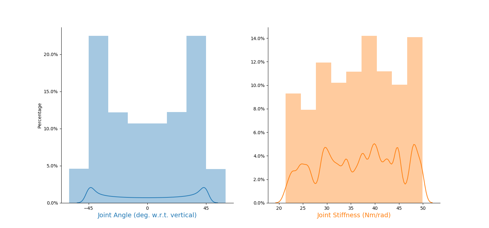</br>
    <small>Figure 13: Histograms and kernel density estimates of joint angle (<em>left</em>) and joint stiffness (<em>right</em>, with smaller upper bounds) when using C<sup>4</sup> differentiable reference trajectories. </small>
</p>
</br>
</br>
<p align="center">
	</br>
    <small>Figure 14: Sample plot of states (and their derivatives when appropriate, denoted by <em>dotted</em> lines) and inputs (6 seconds shown) when using C<sup>4</sup> differentiable reference trajectories.  </small>
</p>
</br>
</br>
<p align="center">
	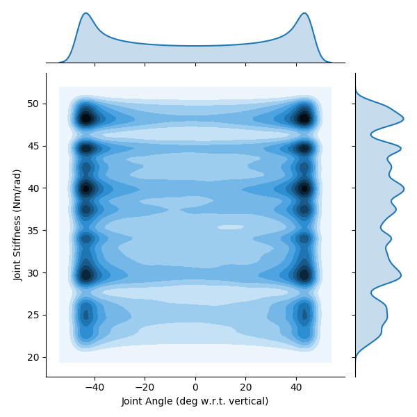</br>
    <small>Figure 15: Two dimensional kernel density estimate plots for joint angle (with respect to vertical) and joint stiffness (smaller upper bounds) when using C<sup>4</sup> differentiable reference trajectories.  </small>
</p>
</br>
