<a href="https://github.com/danhagen/insideOut#freq_sweep">Return to Main Screen</a>

# Experiment to Test How Well ANNs Perform When Movement Frequency is Changed

## Notes

All Results plots and data were generated from `src/run_frequency_sweep.py` while the generalization trajectories were generated from `src/generate_frequency_sweep_trajectories.py`. In order to address generalizability as a function of movement frequency, we decided to test the performance of the four ANNs (trained on 15 seconds of babbling, 15 hidden layer nodes, and 10K epoch limit) on the two tasks where joint angles are varied sinusoidally and the joint stiffness was either covaried sinusoidally with twice the frequency or varied with a ramp and hold trajectory. For each of the movement frequencies explored (0.5, 1, 2, and 4 Hz), the movement amplitude was held constant (<span>&plusmn;45&deg;</span> from vertical).

For the task where both joint angle and joint stiffness are sinusoidal, the same _number of periods_ were used across different frequency trials to ensure that similar configuration space informance was being tested on. Similarly, for the task where joint stiffness was defined by a ramp and hold trajectory, the number of steps was held constant. However, the duration of each step was determined to be equal to 3 periods of the joint angle sinusoid to (i) allow the controller to stabilize along the trajectory (if needed), and (ii) to allow for more reliable data to be collected where the stiffness was relatively constant and the joint angle was varied sinusoidally. With filtering, this produced movements where the joint stiffness is constant for roughly 2 full periods before transitioning to the next value at a 3 Hz cutoff frequency.  

## Parameters

```py
params = {
	'Number of Trials' : 50,
    'Angle Bounds' : [2.356194490192345,3.9269908169872414],
    'Stiffness Bounds' : [20,50],
    'Number of Steps' : 100,
    'Frequencies' : [0.5,1,2,4]
}
```

## Figures

#### 0.5 Hz
<p align="center">
	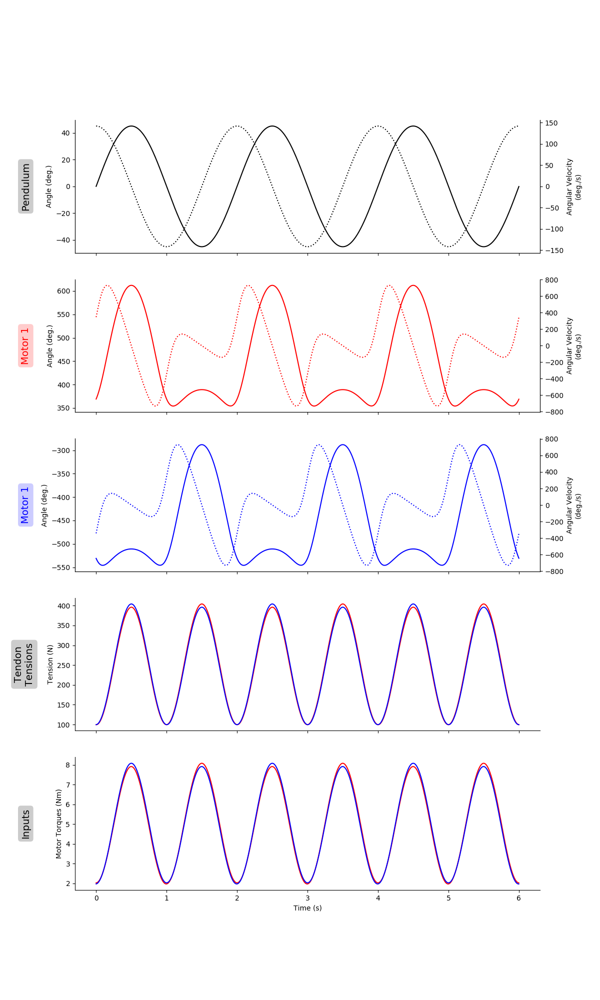</br>
	<small>Figure 1: Sinusoidal Joint Angle (0.5 Hz) with Sinusoidal Joint Stiffness.</small>
</p>
</br>
</br>
<p align="center">
	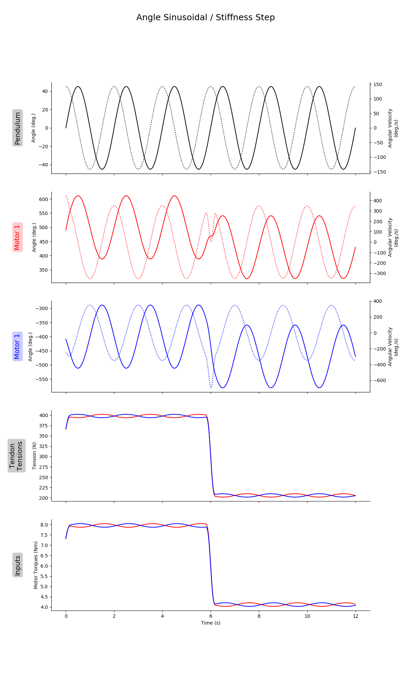</br>
	<small>Figure 2: Sinusoidal Joint Angle (0.5 Hz) with Point-to-Point Joint Stiffness.</small>
</p>

#### 1.0 Hz
<p align="center">
	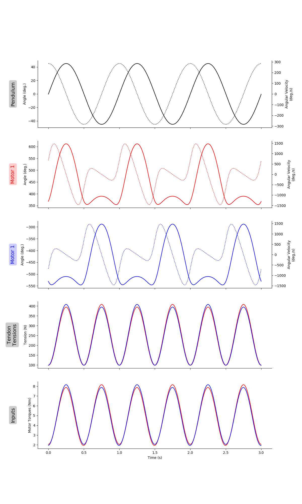</br>
	<small>Figure 3: Sinusoidal Joint Angle (1.0 Hz) with Sinusoidal Joint Stiffness.</small>
</p>
</br>
</br>
<p align="center">
	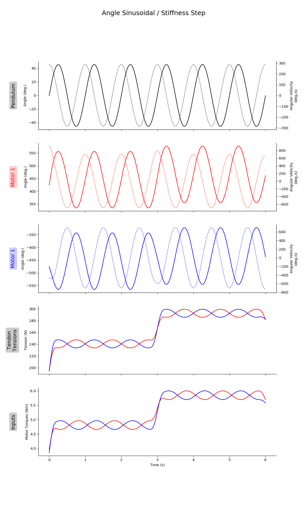</br>
	<small>Figure 4: Sinusoidal Joint Angle (1.0 Hz) with Point-to-Point Joint Stiffness.</small>
</p>

#### 2.0 Hz
<p align="center">
	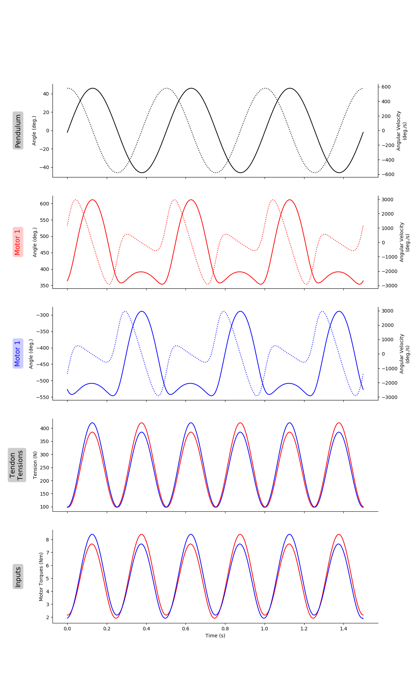</br>
	<small>Figure 5: Sinusoidal Joint Angle (2.0 Hz) with Sinusoidal Joint Stiffness.</small>
</p>
</br>
</br>
<p align="center">
	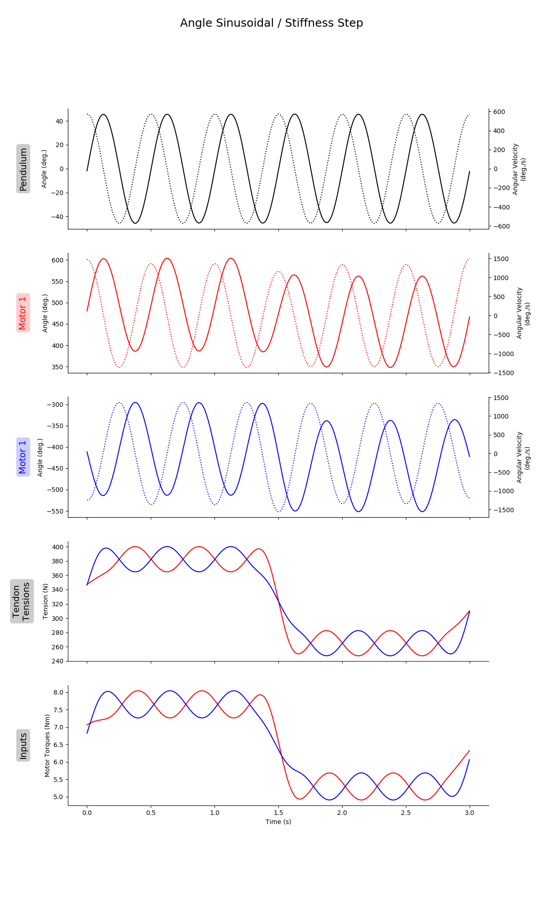</br>
	<small>Figure 6: Sinusoidal Joint Angle (2.0 Hz) with Point-to-Point Joint Stiffness.</small>
</p>

#### 4.0 Hz
<p align="center">
	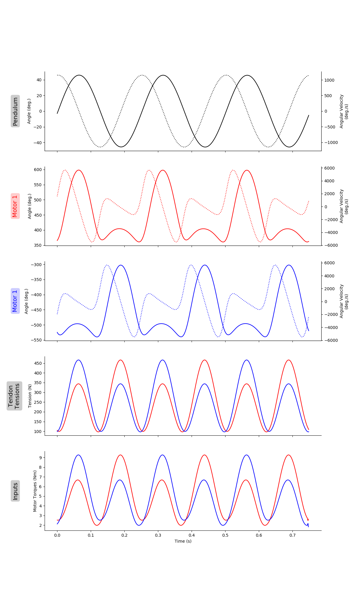</br>
	<small>Figure 7: Sinusoidal Joint Angle (4.0 Hz) with Sinusoidal Joint Stiffness.</small>
</p>
</br>
</br>
<p align="center">
	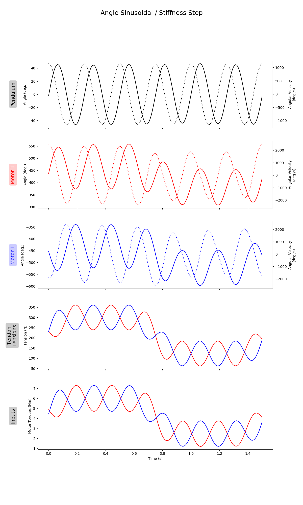</br>
	<small>Figure 8: Sinusoidal Joint Angle (4.0 Hz) with Point-to-Point Joint Stiffness.</small>
</p>

## Results of Trial on 5/14/2020

<p align="center">
	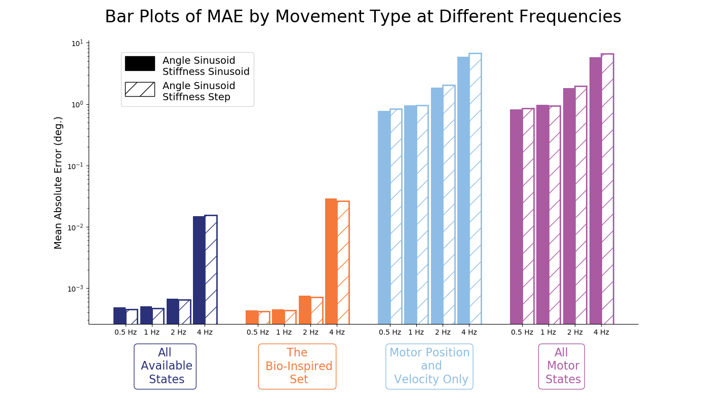</br>
	<small>Figure 9: Average performance (mean absolute error) for 50 ANNs (15 hidden layer nodes) trained on 15 seconds of motor babbling as a function of movement frequency. The solid bars denote the trials where joint stiffness was also varied sinusoidally, while the hatched bars indicate when the stiffness was point-to-point (i.e., <em>ramp and hold</em>). Note that this is plotted on a log scale to demonstrate the trend more clearly. However, it can be said that the sets that are trained on tendon tension data (<em>left two</em>) are better able to generalize to movements of higher frequencies (increasing their average absolute errors from ~<span>0.001&deg;</span> to ~<span>0.01&deg;</span>), compared to the kinematic sets (<em>two right</em>) whose errors increase from ~<span>1&deg;</span> to nearly <span>10&deg;</span>.</small>
</p>
</br>
</br>

<p align="center">
	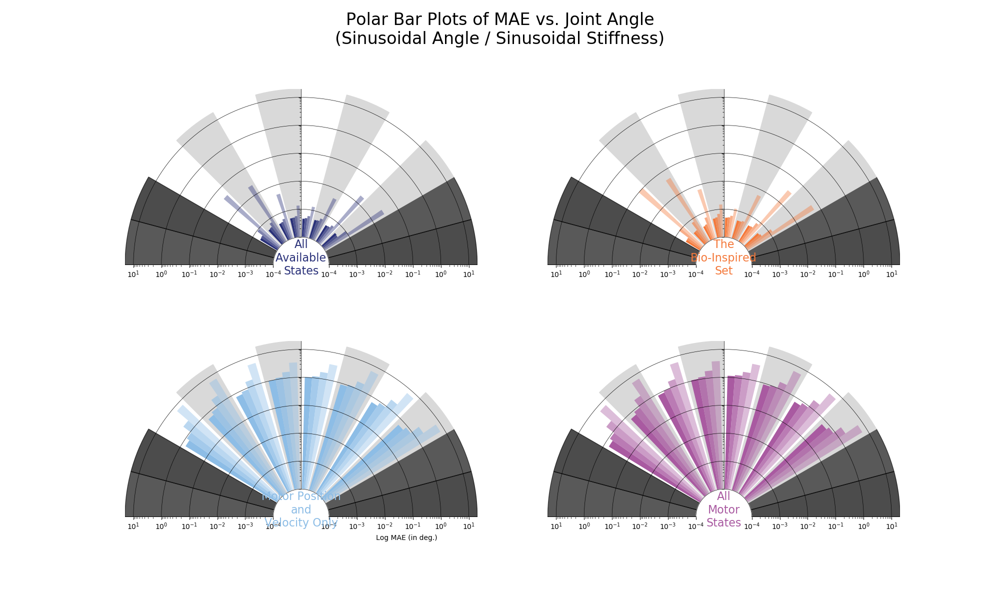</br>
	<small>Figure 10: Radial bar plot of mean absolute error for movements where joint angle and joint stiffness are varied sinusoidally. Performance can be evaluated as a function of both joint angle and movement frequency (<em> dark to light shading: 0.5, 1, 2, 4 Hz</em>). </small>
</p>
</br>
</br>
<p align="center">
	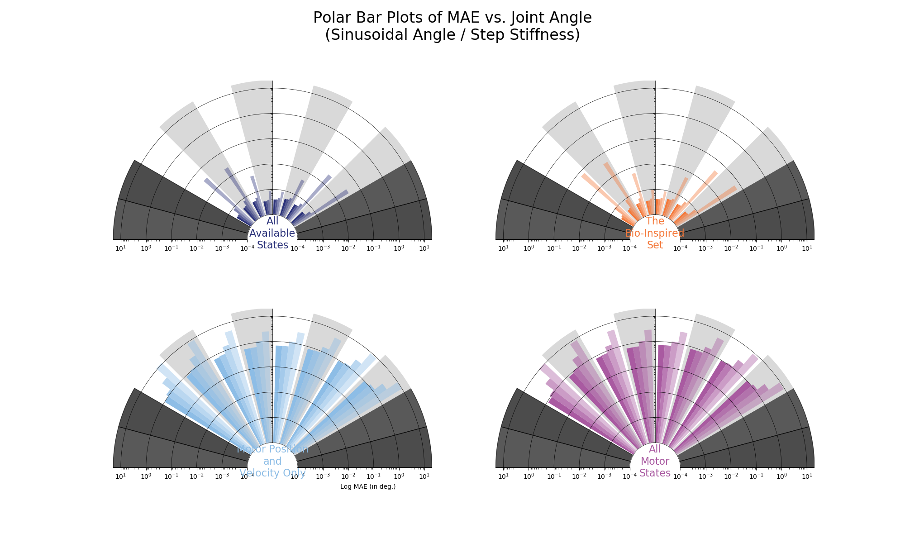</br>
	<small>Figure 11: Radial bar plot of mean absolute error for movements where joint angle is varied sinusoidally while joint stiffness is varied by a <em>ramp and hold</em> pattern. Performance can be evaluated as a function of both joint angle and movement frequency (<em> dark to light shading: 0.5, 1, 2, 4 Hz</em>). </small>
</p>
