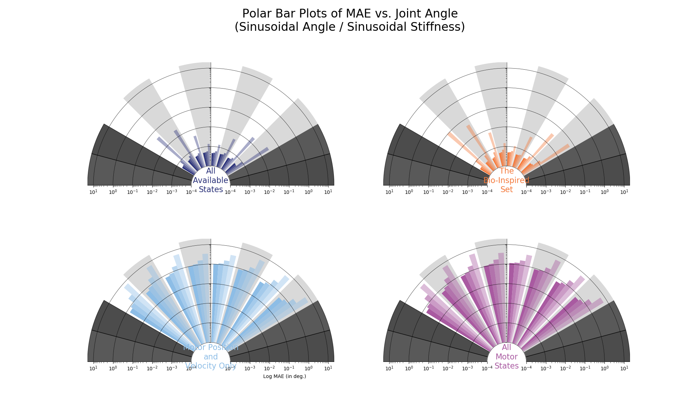
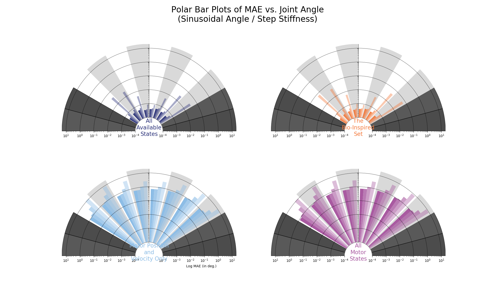

# README.md for Figures Created on 2020/05/14 at 04:17.51 PST.

## Notes

### Generated from `run_frequency_sweep()`

## Parameters

```py
params = {
	'Number of Trials' : 50
}
```

## Figures

<p align="center">
	</br>
	<small>Figure 1: Training performance versus epoch number for all 10 trials for each ANN type.</small>
</p>
</br>
</br>

<p align="center">
	</br>
	<small>Figure 2: Average number of epochs used (<em>N</em>=50).</small>
</p>
</br>
</br>

# Appended on 2020/05/14 at 04:18.16 PST.

## Notes

Figures for metric _MAE_.

## Parameters

```py
params = {
	'metric' : 'MAE'
}
```

## Figures

<p align="center">
	</br>
	<small>Figure 3: Average ANN performance (MAE, <em>N</em>=50) across sensory sets, movements, and movement frequencies.</small>
</p>
</br>
</br>

<p align="center">
	</br>
	<small>Figure 4: Distribution of average performance (MAE, <em>N</em>=50) for sinusoidal joint angle and sinusoidal joint stiffness task.</small>
</p>
</br>
</br>

<p align="center">
	</br>
	<small>Figure 5: Distribution of average performance (MAE, <em>N</em>=50) for sinusoidal joint angle and point-to-point joint stiffness task.</small>
</p>
</br>
</br>

<p align="center">
	</br>
	<small>Figure 6: Average performance (MAE, <em>N</em>=50) for each sensory set and each movement frequency <em>across the joint angle space</em> for sinusoidal joint angle and sinusoidal joint stiffness task.</small>
</p>
</br>
</br>

<p align="center">
	</br>
	<small>Figure 7: Average performance (MAE, <em>N</em>=50) for each sensory set and each movement frequency <em>across the joint angle space</em> for sinusoidal joint angle and point-to-point joint stiffness task.</small>
</p>
</br>
</br>
