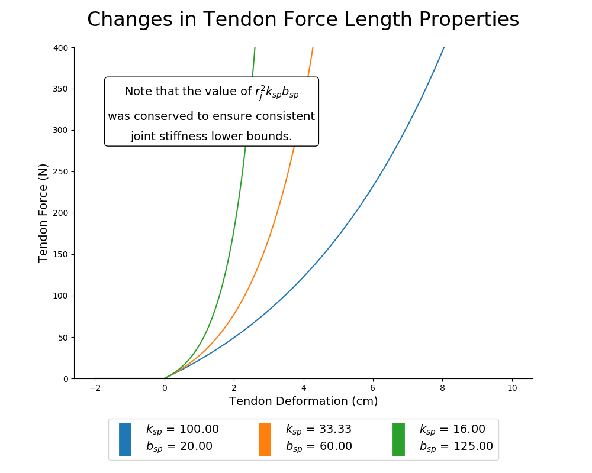

<a href="https://github.com/danhagen/insideOut#plant_sweep" id="top_return_link">Return to Main Screen</a>

# Experiment to Test How Well ANNs Perform When Movement Tendon Stiffness and Motor Damping Parameters Change

## Notes

All Results plots and data were generated from `src/run_plant_parameter_sweep.py` while the generalization trajectories were generated from `src/generate_new_trajectories.py` for the appropriate choice of plant parameters. In order to address generalizability as a function of these two parameters, we tested the performance of ANNs trained on the four sensory sets of interest on the four generalization tasks where joint angles and joint stiffness were either varied sinusoidally or in a point-to-point task, similar to previous experiments. However, new generalization trajectories needed to be generated for each choice of plant parameter values as the control policy used (feedback linearization) will naturally change with changes to the plant.  

## Choices of Tendon Stiffness Parameters

Different values for the tendon force length curve. It is important to note that the lower bounds of the joint stiffness have been kept constant across these variations in plants to avoid problems with comparing similar reference trajectories. The default setting corresponds to the least step curve.

## Parameters

```py
params = {
	'1' : {'Spring Stiffness Coefficient': 100.0, 'Spring Shape Coefficient': 20},
	'2' : {'Spring Stiffness Coefficient': 33.333333333333336, 'Spring Shape Coefficient': 60},
	'3' : {'Spring Stiffness Coefficient': 16.0, 'Spring Shape Coefficient': 125}
}
```

## Figures

<p align="center">
	</br>
	<small>Figure 1: Tendon tension-deformation (stretch) relationships for each of the three choices of tendon stiffness parameters.</small>
</p>
</br>
</br>

## Note on Generalization Trajectories and Sample Plots

For each choice of either tendon stiffness parameters (3 choices) or motor damping parameter (3 choices, 9 total) generalization movements must be regenerated (using `generate_new_trajectories.py` using the appropriate plant parameters). Plots of these movements are similar to the ones presented previously and can be seen in the individual movement folders.

## Motor Babbling Example Plots

Similarly, sample plots for the motor babbling states/inputs and the tendon tension-deformation relationships can be found in `src/Sweep_Plant/sample_plant_plots/` for each choice of tendon stiffness and motor damping parameters.

## Results

<p align="center">
	</br>
	<small>Figure 2: Average ANN performance (MAE, <em>N</em>=50) across changes in both tendon stiffness parameters (denoted by marker styles, see legend in the upper left) and motor damping parameters (x-axis). As we can see there is no clear dependence on motor damping parameters and performance, although a case could be made for the <em>All Motor States</em> set and the low stiffness case of the <em>All Available States</em> set (which makes sense considering they are the only two sets to contain motor acceleration). Additionally, we see that performance decreases for ANNs trained with tendon tension as the tendon stiffness increases, <em>but</em> never performas worse than the ANNs trained without tendon tension.</small>
</p>
</br>
</br>

<p align="center">
	</br>
	<small>Figure 3: Average ANN performance (MAE, <em>N</em>=50) across changes in both tendon stiffness parameters (x-axis) and motor damping parameters (denoted by marker styles, see legend in the upper left). We again see that performance decreases for ANNs trained with tendon tension as the tendon stiffness increases, <em>but</em> never performas worse than the ANNs trained without tendon tension.</small>
</p>
</br>
</br>
