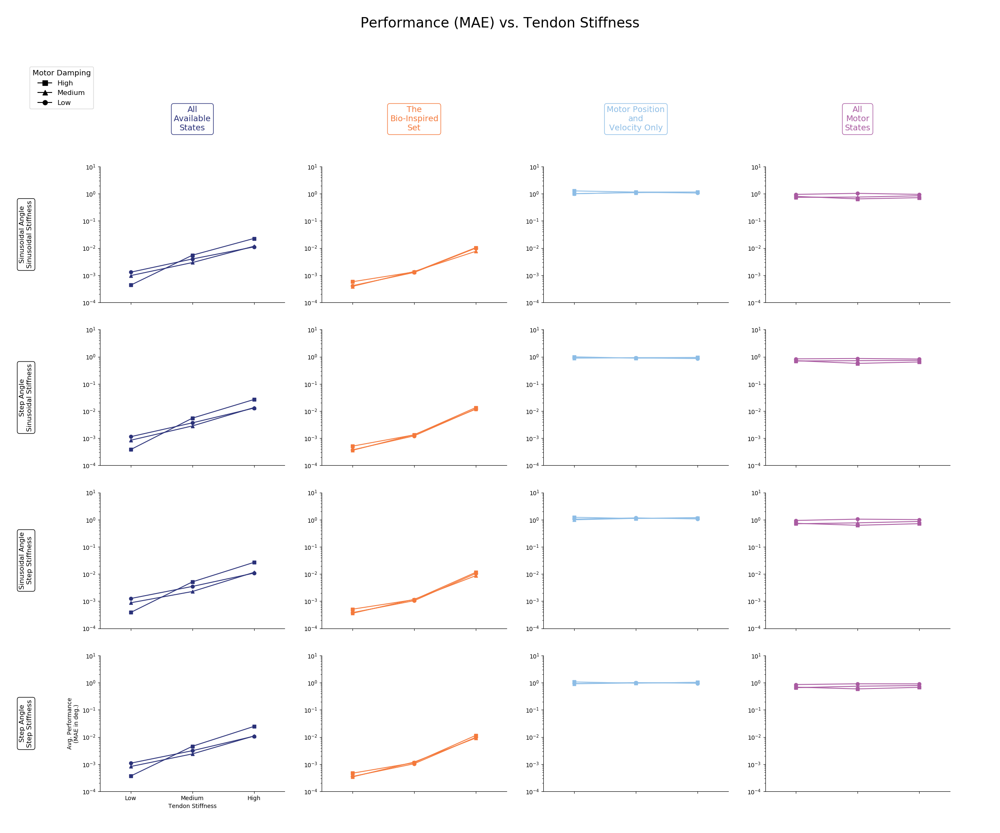

# README.md for Figures Created on 2020/05/18 at 12:50.31 PST.

## Notes

Consolidated trials for plant parameter sweep

## Parameters

```py
params = {
	'Number of Trials' : 45,
	'Babbling Duration' : 15,
	'Number of Nodes' : 15,
	'metrics' : ['MAE'],
	'Babbling Type' : 'continuous',
	'Number of Epochs' : 10000
}

# Motor Damping Parameters >>> motorDampingParams.py
defaultMotorDamping = 0.00462
scalingFactor = 2
motorDampingParams = {
    "1" : defaultMotorDamping/scalingFactor, # N⋅s⋅m⁻¹
    "2" : defaultMotorDamping, # N⋅s⋅m⁻¹
    "3" : defaultMotorDamping*scalingFactor, # N⋅s⋅m⁻¹
}

# Tendon Stiffness Parameters >>> motorDampingParams.py
tendonStiffnessParams = {
    "1" : {
        "Spring Stiffness Coefficient" : 2000/20, # 100 N
        "Spring Shape Coefficient" : 20, # unit-less
    },
    "2" : {
        "Spring Stiffness Coefficient" : 2000/60, # 33.3 N
        "Spring Shape Coefficient" : 60, # unit-less
    },
    "3" : {
        "Spring Stiffness Coefficient" : 2000/125, # 16 N
        "Spring Shape Coefficient" : 125, # unit-less
    }
}
```

## Figures

<p align="center">
	</br>
	<small>Figure 1: Caption for plant_parameter_sweep_MAE_01-01.png.</small>
</p>
</br>
</br>

<p align="center">
	</br>
	<small>Figure 2: Caption for plant_parameter_sweep_MAE_01-02.png.</small>
</p>
</br>
</br>

<p align="center">
	</br>
	<small>Figure 3: Caption for plant_parameter_sweep_MAE_01-03.png.</small>
</p>
</br>
</br>

<p align="center">
	</br>
	<small>Figure 4: Caption for plant_parameter_sweep_MAE_01-04.png.</small>
</p>
</br>
</br>

<p align="center">
	</br>
	<small>Figure 5: Caption for plant_parameter_sweep_MAE_01-05.png.</small>
</p>
</br>
</br>

<p align="center">
	</br>
	<small>Figure 6: Caption for plant_parameter_sweep_MAE_01-06.png.</small>
</p>
</br>
</br>

<p align="center">
	</br>
	<small>Figure 7: Caption for plant_parameter_sweep_MAE_01-07.png.</small>
</p>
</br>
</br>
