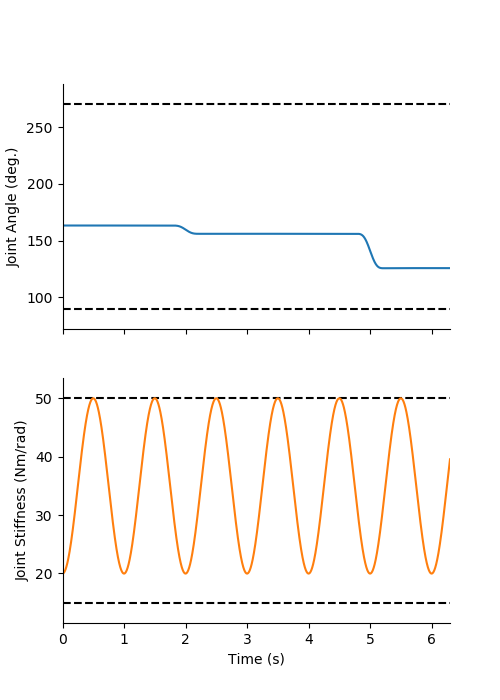
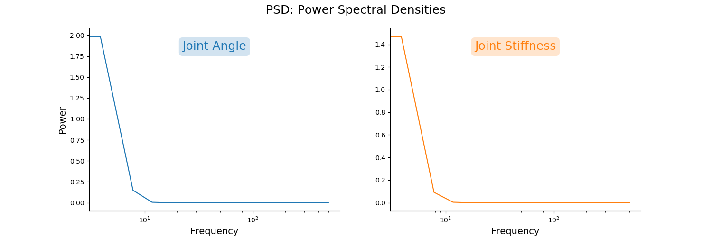
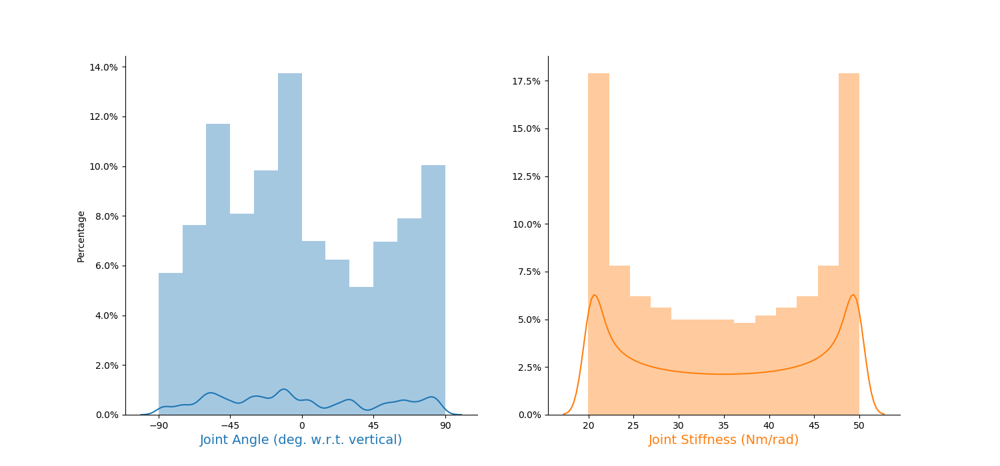
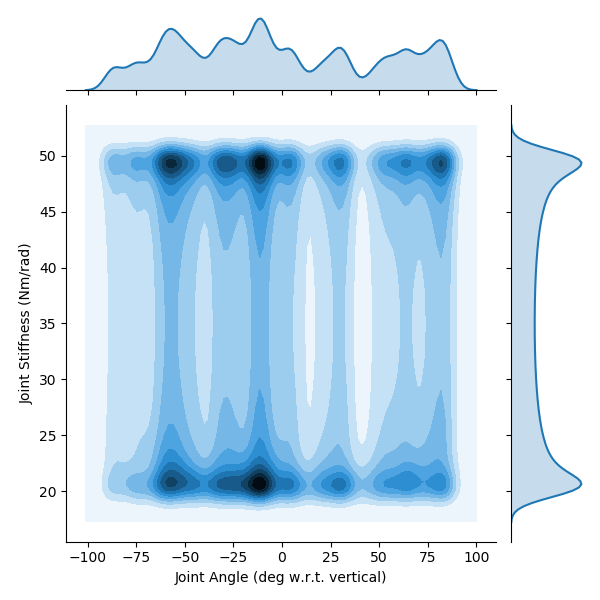
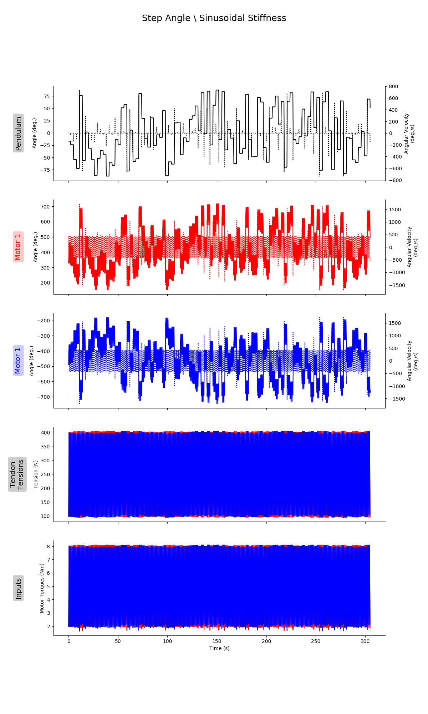
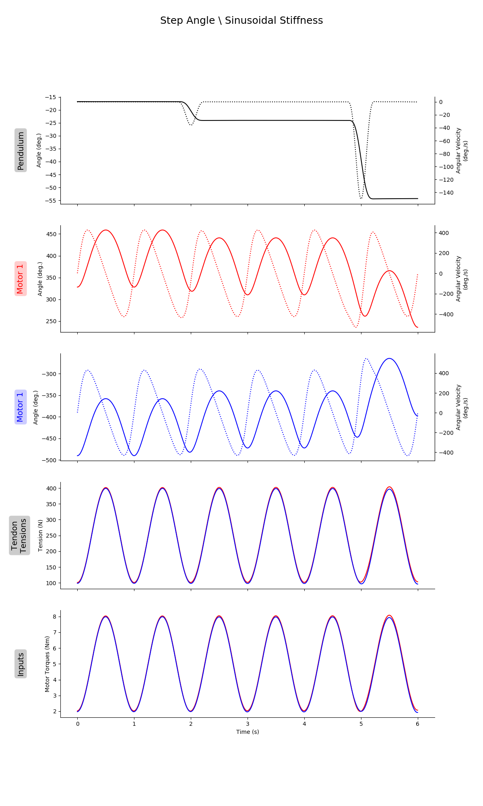

# README.md for Figures Created on 2020/05/29 at 13:04.02 PST. 

## Notes

Generalization Trajectories for Settings kT1 and bm3.

## Parameters 

```py
params = {
	'Extra Steps' : 5,
	'Step Duration' : 2,
	'Number of Steps' : 100,
	'delay' : 0.3,
	'Angle Range' : [1.5707963267948966, 4.71238898038469],
	'Stiffness Range' : [20, 50],
	'Tendon Stiffness Coefficients' : {'Spring Stiffness Coefficient': 100, 'Spring Shape Coefficient': 20},
	'Motor Damping' : 0.00924
}
```

## Figures

<p align="center">
	</br>
	<small>Figure 1: Caption for gen_traj_plot_01-01.png.</small>
</p>
</br>
</br>

<p align="center">
	</br>
	<small>Figure 2: Caption for gen_traj_plot_01-02.png.</small>
</p>
</br>
</br>

<p align="center">
	</br>
	<small>Figure 3: Caption for gen_traj_plot_01-03.png.</small>
</p>
</br>
</br>

<p align="center">
	</br>
	<small>Figure 4: Caption for gen_traj_plot_01-04.png.</small>
</p>
</br>
</br>

<p align="center">
	</br>
	<small>Figure 5: Caption for gen_traj_plot_01-05.png.</small>
</p>
</br>
</br>

<p align="center">
	</br>
	<small>Figure 6: Caption for gen_traj_plot_01-06.png.</small>
</p>
</br>
</br>

<p align="center">
	</br>
	<small>Figure 7: Caption for gen_traj_plot_01-07.png.</small>
</p>
</br>
</br>

