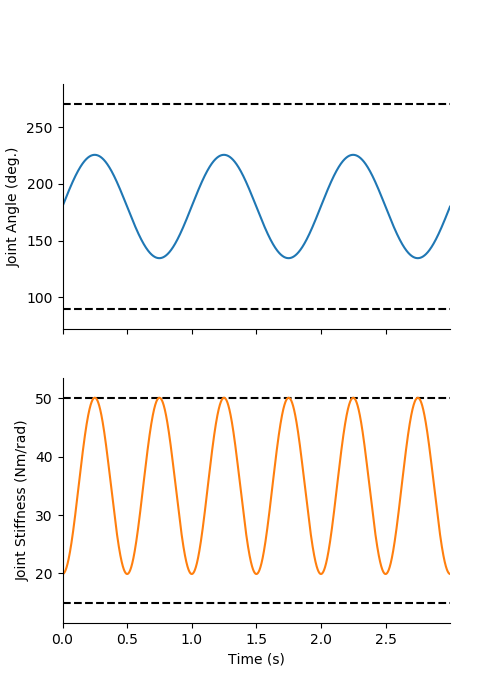
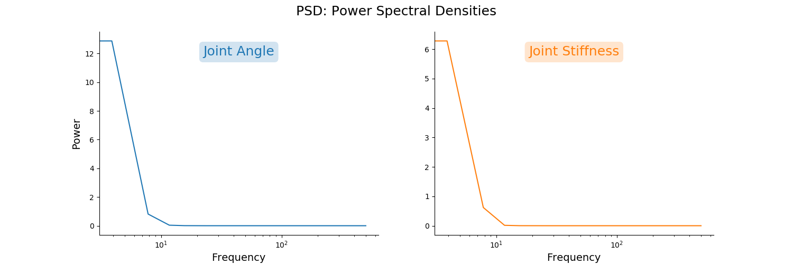
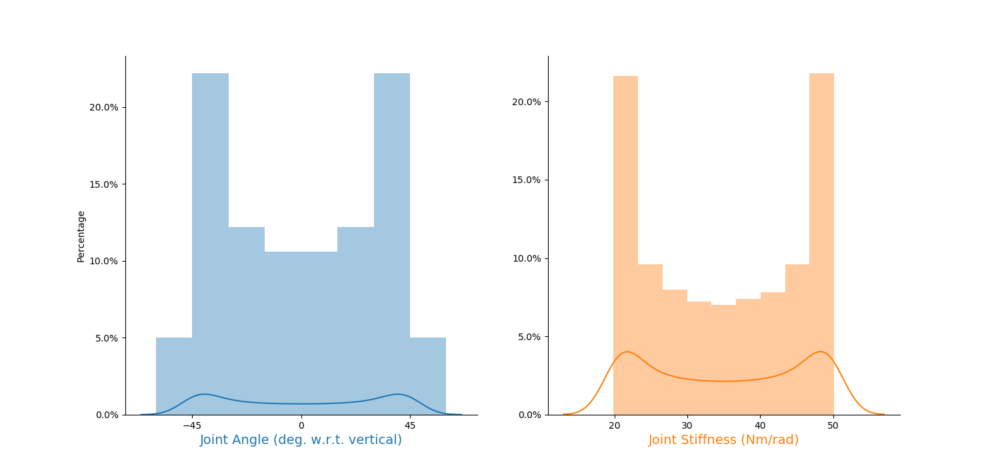
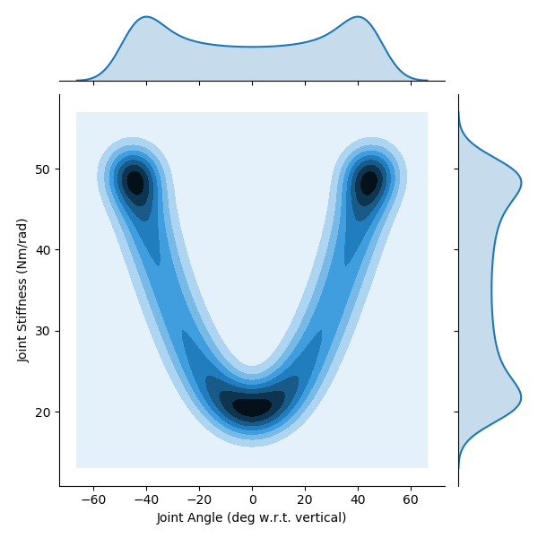
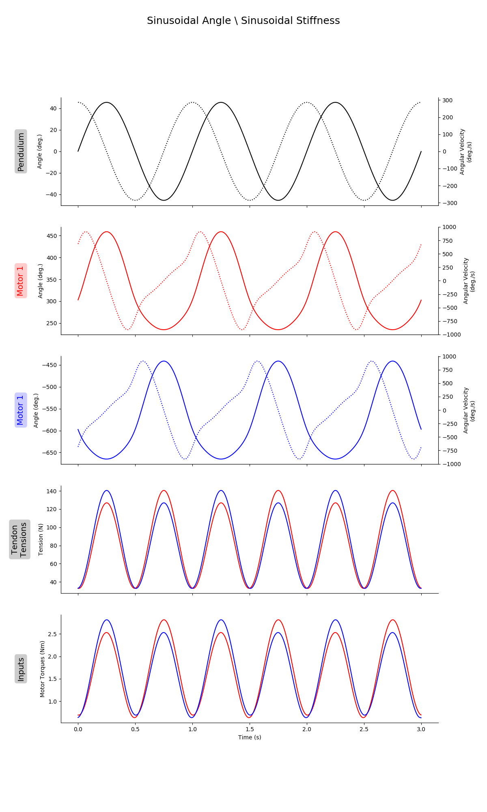
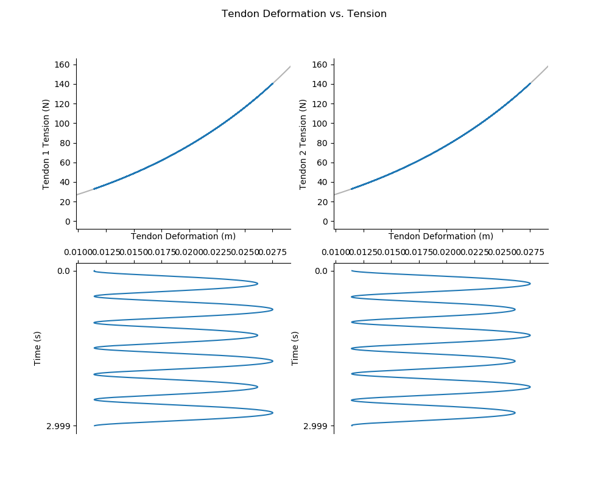

# README.md for Figures Created on 2020/05/29 at 13:13.55 PST. 

## Notes

Generalization Trajectories for Settings kT2 and bm1.

## Parameters 

```py
params = {
	'Extra Steps' : -3,
	'Step Duration' : None,
	'Number of Steps' : None,
	'delay' : 0.3,
	'Angle Range' : [2.356194490192345, 3.9269908169872414],
	'Stiffness Range' : [20, 50],
	'Tendon Stiffness Coefficients' : {'Spring Stiffness Coefficient': 33.333333333333336, 'Spring Shape Coefficient': 60},
	'Motor Damping' : 0.00231
}
```

## Figures

<p align="center">
	</br>
	<small>Figure 1: Caption for gen_traj_plot_01-01.png.</small>
</p>
</br>
</br>

<p align="center">
	</br>
	<small>Figure 2: Caption for gen_traj_plot_01-02.png.</small>
</p>
</br>
</br>

<p align="center">
	</br>
	<small>Figure 3: Caption for gen_traj_plot_01-03.png.</small>
</p>
</br>
</br>

<p align="center">
	</br>
	<small>Figure 4: Caption for gen_traj_plot_01-04.png.</small>
</p>
</br>
</br>

<p align="center">
	</br>
	<small>Figure 5: Caption for gen_traj_plot_01-05.png.</small>
</p>
</br>
</br>

<p align="center">
	</br>
	<small>Figure 6: Caption for gen_traj_plot_01-06.png.</small>
</p>
</br>
</br>

