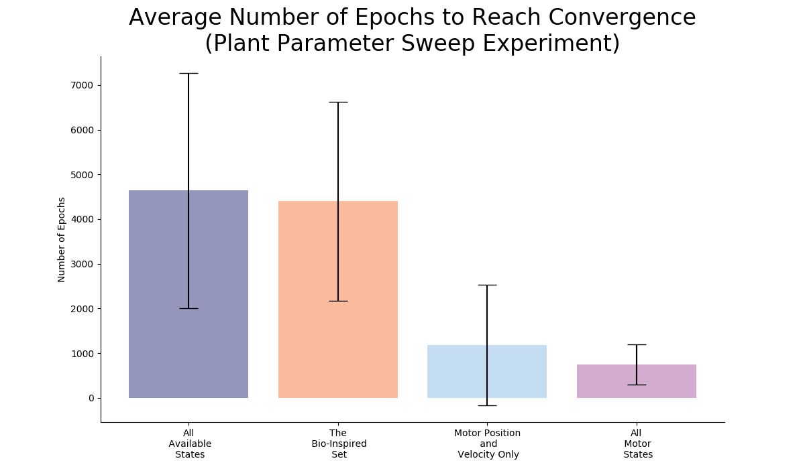
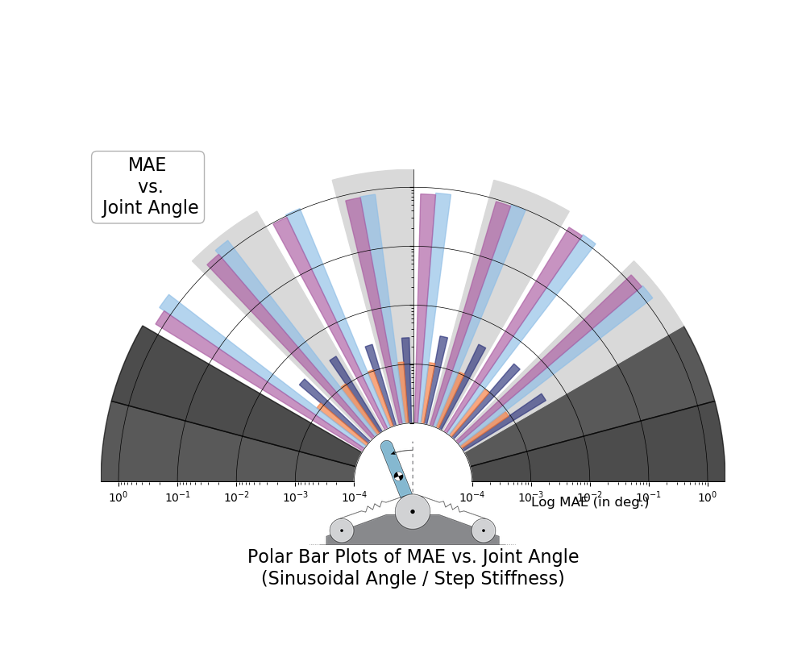

# README.md for Figures Created on 2020/05/17 at 06:57.56 PST.

## Notes

### Generated from `run_plant_parameter_sweep()` for Medium Tendon Stiffness and Low Motor Damping

## Parameters

```py
params = {
	'Number of Trials' : 50
}
```

## Figures

<p align="center">
	</br>
	<small>Figure 1: Training performance versus the number of epochs used to train each network. ANNs trained with tendon tension (<em>dark blue</em> and <em>orange</em>) take longer to converge and do so at a significantly lower training error compared to ANNs trained without tendon tension (<em>light blue</em> and <em>purple</em>).</small>
</p>
</br>
</br>

<p align="center">
	</br>
	<small>Figure 2: Average number of epochs used to train each network.</small>
</p>
</br>
</br>


# Appended on 2020/05/18 at 12:01.09 PST.

## Notes

Figures for metric _MAE_.

## Parameters

```py
params = {
	'metric' : 'MAE'
}
```

## Figures

<p align="center">
	</br>
	<small>Figure 3: Average ANN performance (MAE, <em>N</em>=50) across sensory sets and movements.</small>
</p>
</br>
</br>

<p align="center">
	</br>
	<small>Figure 4: Distribution of average performance (MAE, <em>N</em>=50) for sinusoidal joint angle and sinusoidal joint stiffness task.</small>
</p>
</br>
</br>

<p align="center">
	</br>
	<small>Figure 5: Distribution of average performance (MAE, <em>N</em>=50) for point-to-point joint angle and sinusoidal joint stiffness task.</small>
</p>
</br>
</br>

<p align="center">
	</br>
	<small>Figure 6: Distribution of average performance (MAE, <em>N</em>=50) for sinusoidal joint angle and point-to-point joint stiffness task.</small>
</p>
</br>
</br>

<p align="center">
	</br>
	<small>Figure 7: Distribution of average performance (MAE, <em>N</em>=50) for point-to-point joint angle and point-to-point joint stiffness task.</small>
</p>
</br>
</br>

<p align="center">
	</br>
	<small>Figure 8: Average performance (MAE, <em>N</em>=50) for each sensory set <em>across the joint angle space</em> for sinusoidal joint angle and sinusoidal joint stiffness task.</small>
</p>
</br>
</br>

<p align="center">
	</br>
	<small>Figure 9: Average performance (MAE, <em>N</em>=50) for each sensory set (combined) <em>across the joint angle space</em> for sinusoidal joint angle and sinusoidal joint stiffness task.</small>
</p>
</br>
</br>

<p align="center">
	</br>
	<small>Figure 10: Average performance (MAE, <em>N</em>=50) for each sensory set <em>across the joint angle space</em> for point-to-point joint angle and sinusoidal joint stiffness task.</small>
</p>
</br>
</br>

<p align="center">
	</br>
	<small>Figure 11: Average performance (MAE, <em>N</em>=50) for each sensory set (combined) <em>across the joint angle space</em> for point-to-point joint angle and sinusoidal joint stiffness task.</small>
</p>
</br>
</br>

<p align="center">
	</br>
	<small>Figure 12: Average performance (MAE, <em>N</em>=50) for each sensory set <em>across the joint angle space</em> for sinusoidal joint angle and point-to-point joint stiffness task.</small>
</p>
</br>
</br>

<p align="center">
	</br>
	<small>Figure 13: Average performance (MAE, <em>N</em>=50) for each sensory set (combined) <em>across the joint angle space</em> for sinusoidal joint angle and point-to-point joint stiffness task.</small>
</p>
</br>
</br>

<p align="center">
	</br>
	<small>Figure 14:  Average performance (MAE, <em>N</em>=50) for each sensory set <em>across the joint angle space</em> for point-to-point joint angle and point-to-point joint stiffness task.</small>
</p>
</br>
</br>

<p align="center">
	</br>
	<small>Figure 15:  Average performance (MAE, <em>N</em>=50) for each sensory set (combined) <em>across the joint angle space</em> for point-to-point joint angle and point-to-point joint stiffness task.</small>
</p>
</br>
</br>

<p align="center">
	</br>
	<small>Figure 16: Average performance (MAE, <em>N</em>=50) for each sensory set <em>across the joint angle space and joint stiffness space</em> for sinusoidal joint angle and sinusoidal joint stiffness task.</small>
</p>
</br>
</br>

<p align="center">
	</br>
	<small>Figure 17: Average performance (MAE, <em>N</em>=50) for each sensory set <em>across the joint angle space and joint stiffness space</em> for point-to-point joint angle and sinusoidal joint stiffness task.</small>
</p>
</br>
</br>

<p align="center">
	</br>
	<small>Figure 18: Average performance (MAE, <em>N</em>=50) for each sensory set <em>across the joint angle space and joint stiffness space</em> for sinusoidal joint angle and point-to-point joint stiffness task.</small>
</p>
</br>
</br>

<p align="center">
	</br>
	<small>Figure 19: Average performance (MAE, <em>N</em>=50) for each sensory set <em>across the joint angle space and joint stiffness space</em> for point-to-point joint angle and point-to-point joint stiffness task.</small>
</p>
</br>
</br>
