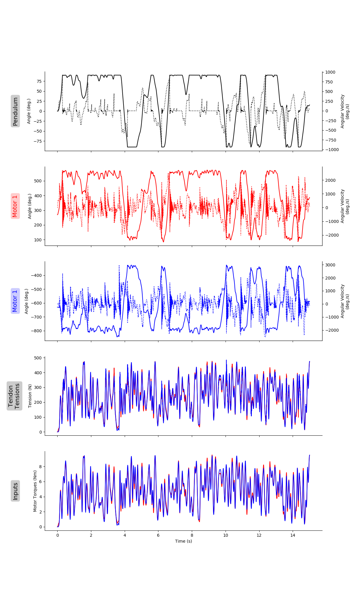
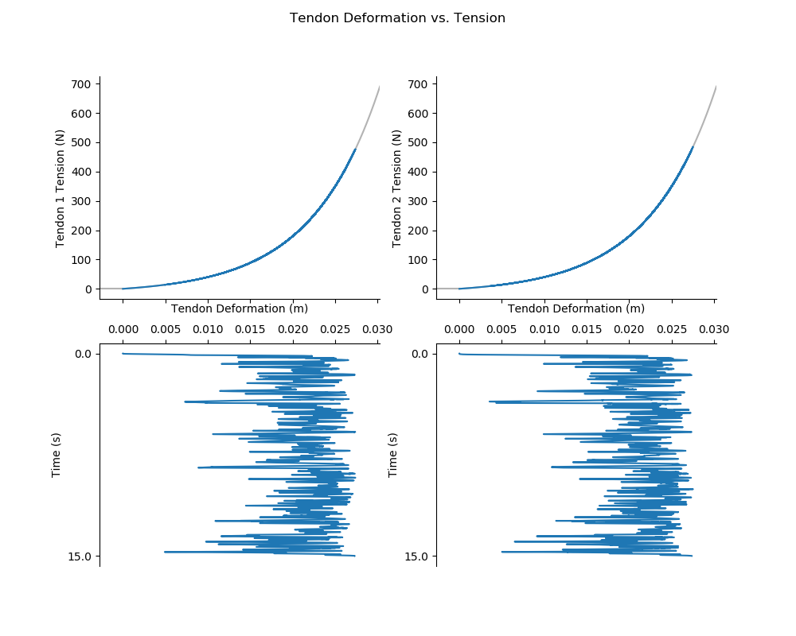

# README.md for Figures Created on 2020/05/16 at 03:01.15 PST. 

## Notes

(Add Notes Here.)

## Parameters 

```py
params = {
	'Joint Inertia' : 0.0115,
	'Joint Damping' : 0.0001,
	'Joint Mass' : 0.541,
	'Joint Moment Arm' : 0.05,
	'Link Center of Mass' : 0.085,
	'Link Length' : 0.3,
	'Motor Inertia' : 6.6e-05,
	'Motor Damping' : 0.00231,
	'Motor Moment Arm' : 0.02,
	'Spring Stiffness Coefficient' : 16,
	'Spring Shape Coefficient' : 125,
	'Quadratic Stiffness Coefficient 1' : 10000,
	'Quadratic Stiffness Coefficient 2' : -4962.32258089,
	'Simulation Duration' : 15,
	'dt' : 0.001,
	'Position Gains' : {0: 3162.3, 1: 1101.9, 2: 192.0, 3: 19.6},
	'Stiffness Gains' : {0: 316.2, 1: 25.1},
	'Joint Angle Bounds' : {'LB': 1.5707963267948966, 'UB': 4.71238898038469},
	'Maximum Joint Stiffness' : 50,
	'Boundary Friction Weight' : 3,
	'Boundary Friction Gain' : 1,
	'Seed' : None,
	'Filter Length' : 10,
	'Pass Probability' : 0.00025,
	'Input Bounds' : [0, 10],
	'Low Cutoff Frequency' : 1,
	'High Cutoff Frequency' : 10,
	'Buttersworth Filter Order' : 9,
	'Babbling Type' : 'continuous',
	'Force Cocontraction' : True,
	'Cocontraction Standard Deviation' : 0.5,
	'Number of Nodes' : 15,
	'Number of Epochs' : 10000,
	'Number of Trials' : 50
}
```

## Figures

<p align="center">
	</br>
	<small>Figure 1: Caption for new_trajectories_01-01.png.</small>
</p>
</br>
</br>

<p align="center">
	</br>
	<small>Figure 2: Caption for new_trajectories_01-02.png.</small>
</p>
</br>
</br>

